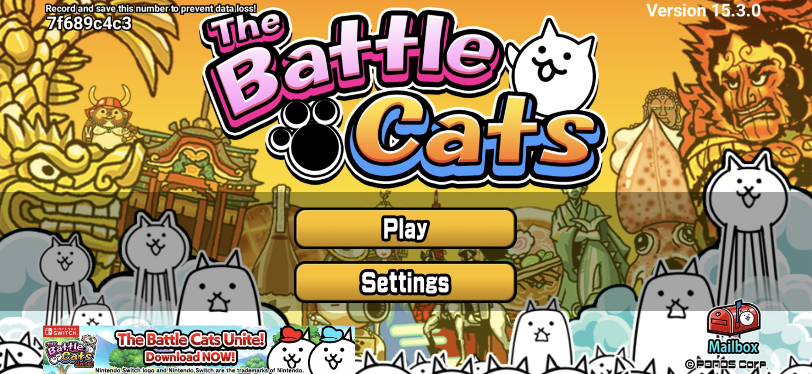
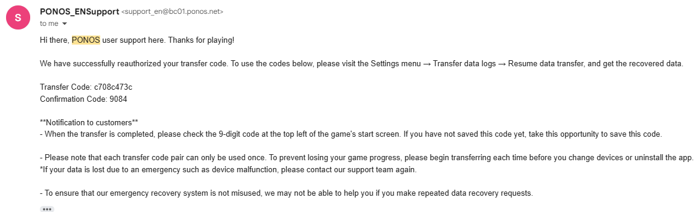

## Step 0: Linking to Google/Apple

In the menu, there is an option to link your account to either a Google or Apple account. By doing this, you can recover your game by simply starting the game up, going to "Change Account/Device", pressing "Link Account", pressing "Recover Data from a Linked Account," and then signing in. This allows you to link your account quickly without the need to write down your inquiry code. (**This is the only way to recover your save data if you do not remember your inquiry code.**) However, you can only do this once every 90 days. If you are prone to switching devices, this method is not recommended. 

## Step 1: Finding your inquiry code

Your inquiry code is absolutely necessary for PONOS to retrieve your save data. **If you do not have your inquiry code, it is impossible for you to get your save data back, and you will have to make a fresh account.** If you haven’t yet, write this down or screenshot it to make sure you can find it in case your save goes missing. The inquiry code is located in the top left of the main menu screen. Make sure to tap "Show Code" as well, so if you ever have to post a picture of the main title screen, you won't accidently leak your inquiry code. 

Note that if you have done this before and need to do it again, your inquiry code will change when you transfer your game to a new account, so remember to frequently check your inquiry code. 

## Step 2: Emailing PONOS support

The next step is to request PONOS to recover your save data. You will need to send an email to [support_en@bc01.ponos.net](mailto:support_en@bc01.ponos.net) for the English version of the game. In this email, you should list your inquiry code, the time since you last logged in, and your estimated user rank and catfood amount. This will give PONOS support all the information they should need to recover your save. Once the email is sent, you should get a response within 1-4 business days. If you didn’t provide enough information, the support member may ask you to list your user rank and catfood amount, or the device which you last played on. To avoid having to wait longer for a second response, it is recommended that you include all of the information possible in your first email. You don't need to be perfect with your memory, but if you write that your account has 2000 User Rank when in reality it has 9000, for example, there is a chance that PONOS will reject your request.

##### Additional version support

- Battle Cats JP - [support_jp@bc01.ponos.net](mailto:support_jp@bc01.ponos.net)
- Battle Cats TW - [support_tw@bc01.ponos.net](mailto:support_tw@bc01.ponos.net)
- Battle Cats KR - [support_ko@bc01.ponos.net](mailto:support_ko@bc01.ponos.net)

## Step 3 - Entering your transfer codes

Once PONOS recovers your save data, they will send you
an email that looks like this

Note the "Transfer Code" and "Confirmation Code" at the bottom. These codes are how you will return your save data to your Battle Cats app. Here is [a video](https://youtu.be/rGwj6KFrCTU) showing how codes can be entered into the Battle Cats app.

_Note: The video uses a fresh account as an example._

Step-by-step guide:

1. From the main menu, select Settings > Data Transfer
2. Select "Resume Data Transfer"
3. Type in your transfer and confirmation codes
4. Select "Resume Transfer"
5. Select "Return to Title Screen"
6. The game will now load normally.

**Note that because PONOS does not automatically back up game data, your progress may be slightly behind where you left off.** However, this usually will only set you back a day or two at most. In many cases, your game progress will not be affected at all.

## Credits

**totally_anonymous**#0405 (original guide redaction) \
**Waran-Ess**#9801 (web conversion) \
**goomister29** (updating screenshots)
