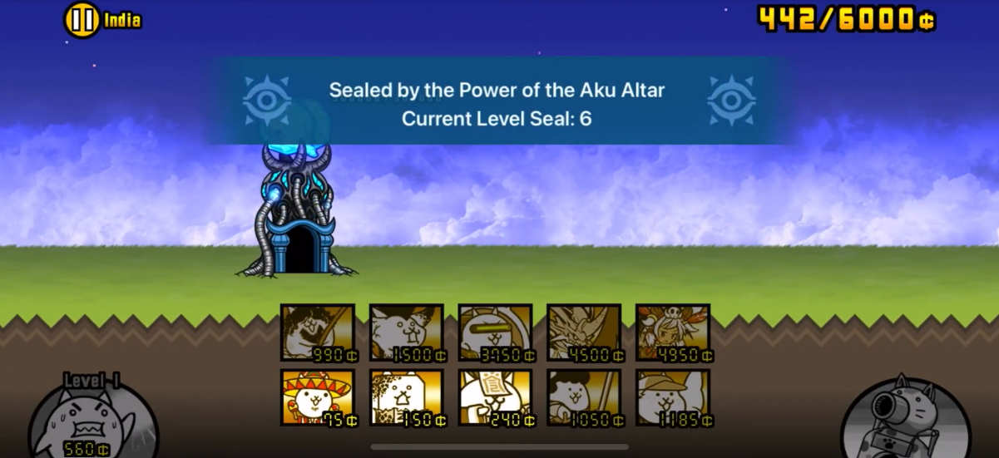

## Introduction

In v10.8, Ponos added the Aku Realms and its related content to the game. It acts as a bonus chapter for Empire of Cats, with the Aku Altar as its primary gimmick. Much like zombie outbreaks, stages in the Aku Realms also show up at random and refresh after a fixed three-hour window. The “Aku” enemy trait was officially introduced to the player, and was featured as the main obstacle in the Aku Realms.

## What is "Aku Altar"?

The Aku Altar is a specific kind of animated base, most often found in Aku-infested stages. If the Aku Altar is featured in a stage, a restriction is put on the level for all units. The level of your units are capped at the level of the Aku Altar Seal (Plus levels are disabled). For example, if the current Aku Altar Seal level is 10, your lv20 Crazed Tank and lv30+2 Ramen Cat will both only have lv10 stats for the stage. Your lv8 Crazed Cat’s stats will remain lv8.

Aku Alter Seal level always starts at 1\. The only way to reverse the effect of the seal, is to progress the Aku Realms. Each stage clear will lift the seal level by 1\. Only after conquering the entire chapter will the Aku Altar be fully disabled.

_*Example of a stage featuring an active Aku Altar_
## How to Access

To gain access to the Aku Realms, you must first clear the three maps from the Empress Research mission: **Arcane Confluence**, **Servant of Darkness**, **Demon’s Park**. They only show up during specific time periods of the day and week. You can only do one stage of each map per day. Upon clearing the aforementioned three maps, **Wicked Cat**, **Wicked Tank**, and **Wicked Axe** will be unlocked respectively.

|                                 |                                                                                                                     |
| :------------------------------ | :------------------------------------------------------------------------------------------------------------------ |
| Arcane Confluence/Wicked Cat    | Monday, Friday: 08:00\~10:00 Tuesday, Saturday: 12:00\~14:00 Wednesday, Sunday: 19:00\~21:00 Thursday: 22:00\~24:00 |
| Servant of Darkness/Wicked Tank | Monday, Friday: 12:00\~14:00 Tuesday, Saturday: 19:00\~21:00 Wednesday, Sunday: 22:00\~24:00 Thursday: 08:00\~10:00 |
| Demon’s Park/Wicked Axe         | Monday, Friday: 19:00\~21:00 Tuesday, Saturday: 22:00\~24:00 Wednesday, Sunday: 08:00\~10:00 Thursday: 12:00\~14:00 |

\*These maps cannot be replayed after the first clear

Once you have cleared all three of the wicked cat maps, the final map Unleashing the Cats shows up. There is no time limit and it will disappear after the first clear as well.

Doing all of this will yield you 300 catfood total from missions (excluding the 30 catfood you get for clearing each map), and more importantly, grant you access to the Aku Realms.

## The Benefits

So why should you care about the Aku Realms?

### Benefits for Unlocking Aku Realms

First of all, alongside Aku Realms, you also gain access to the **Empress’ Report** and the **Empress’ Excavation** missions. The former rewards you with battle items, Catamins, Legend Catseyes, Aku Fruit Seeds, and Platinum Shards for completion. The latter rewards you with various Ancient Eggs.

The eggs you get from Empress’ Excavation include N001 (Haniwa Cat), N003 (Cat Cactus), N004 (Supercar Cat), N005 (Hitman Cat), and N006 (Fallen Bear Cat).

Additionally, **Growing Evil** and **XP Bonanza\!** will be unlocked. Growing Evil is the primary map for Aku fruit farming whereas XP Bonanza is currently the most efficient XP farming map in the game. However, both of these maps feature the Aku Altar. It is advised to tackle these stages only after you have progressed a decent amount of the main Aku Realms.

Moreover, the Uncanny Legend sub-chapter **Imminent Disaster** requires the players to have completed Unleashing the Cats. In other words, unlocking Aku Realms is **mandatory** for the progression of the game.

### Benefits for Progressing and Completing Aku Realms

Beating Mount Aku rewards you with a **Gold Catfruit**. Beating Moon rewards you with a **Platinum Ticket**. Beating the final stage, Mount Aku Invasion, rewards you with the unit **Jagando Jr.** and deactivates the Aku Altar Seal.

Several challenging stages become much more manageable for the players once the effect of the seal is disabled (Aku’s Reincarnation, Aku’s Melody, Infernal Tyrant III and Climax, Infernal Tower Floor 30, etc).

## Progression and Preparation

### When Should You Progress the Aku Realms?

A player is free to start doing the content of Aku Realms whenever they obtain access to it. Averagely speaking, you should have beaten Into the Future Ch1&2 and acquired some crazed cats by the time you undertake the first stage of Aku Realms.

Do the stages from time to time, just like how you do zombie outbreaks. If a stage poses too much of a threat for you, do other stages to raise the seal level first; If even higher seal level doesn’t help, get the mandatory treasures or units.

As for the final stretch of Aku Realms, you should have beaten Cats of the Cosmos. Late Sol\~Early UL is the desired time period for finishing Aku Realms.

### Preparation and Units

The first 30 or so stages remain relatively low-stake in terms of difficulty. The following units/things are highly recommended if you want to go through these stages effortlessly:

- 100% Empire of Cats & Into the Future treasures
- Awakened Bahamut Cat
- Ururun Wolf, and Courier Cat
- Most or all of the Crazed cats
- Max/High priority True Forms of gacha rares & super rares (Cameraman, Ramen, Catasaurus, Can can, Pizza, Seafarer, Octopus, Fishman, etc)
- Bomber Cat

Starting from Mount Aku, the difficulty begins to pick up. The following units/things are highly recommended if you wish to confront the new challenge:

- Cats of the Cosmos chapter 1 & 2 treasures
- Most or all of Manic cats
- Cyclone units (Waitress, Catyphoon, etc)
- Aku Researcher
- Advent units (Maglev, Slime, etc)
- All Cat cannons except Curseblast (mostly Holyblast and Breakerblast)

The final few stages, including Jagando Invasion, are easily the hardest Aku Realms have to offer. The following units/things are highly recommended if you want to put an end to High Priest Mamon’s reign once in for all:

- 100% Cats of the Cosmos treasures
- Max/High priority Talents (Bahamut explosion, Can can double bounty & speed, Catasaurus critical hit, Pizza wave attack, Housewife savage blow, etc)
- Cat Researcher
- True Form of Advent units (Bullet train, Jelly Dumpling, Macho Crystal, etc)
- Boulder Cat (Metal Macho can serve as a Pre-UL alternative)

### What You _Don’t_ Need

- Anti-Aku Ubers: Most players’ first perception about Aku enemies is that they are tough, late-game enemies. “To even have a fighting chance you need at least one anti-Aku Uber rare.” This is not true. While the Aku enemies can be tough, they are no more than what a standard player can handle. You’ll be fine with just your generalist units for the most part.
- Specialized Anti-Aku Meatshield: Similarly, players might believe only specialized anti-Aku meatshields can deal with the pushing power of Aku enemies. You don’t need to spend your precious resources on Bellydancer talents or Cactus, nor do you need to rush Invasion of the Swamplord early on for Maize cat. Your regular meatshields, and Boulder for the last few stages, are more than viable to stall the enemies in Aku Realms.
- Additional Shield Piercers: Aku enemies are fearsome for their tough, durable shields. Even more dreadful if they regenerate. Because of this, many players make hasty decisions to spend hefty resources on extra shield piercers that they don’t need. Li’l Macho Leg talents, Barrel, Supercar, to name a few. In practice, most of the Aku shields can be bruteforced, or reasonably only require Aku researcher as the sole shield piercer.
- Surge Immune Units: Aku enemies are often associated with heavy surge spam stages. However, surges that appear in Aku Realms are quite scarce. Surge immune units are hardly ever mandatory for these stages.
- Plus Level Boosts: Remember, Aku Altar disables plus levels. Your normal cats only have lv20 stats at best.
