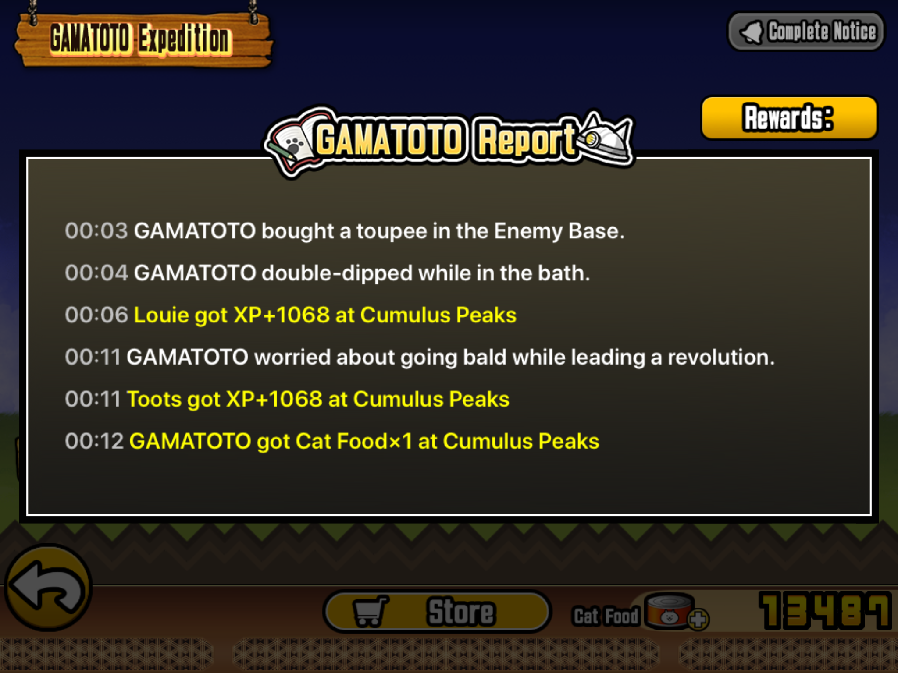
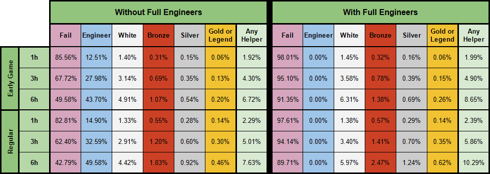
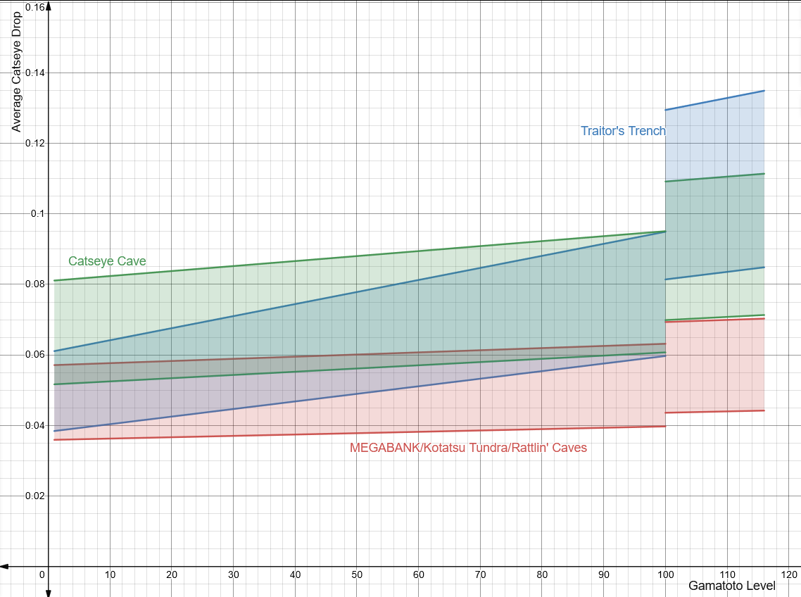
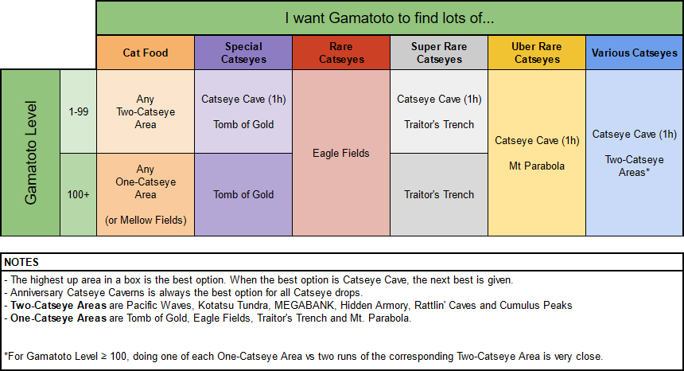
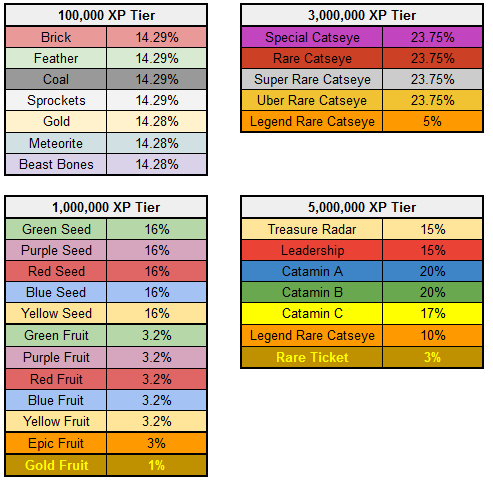
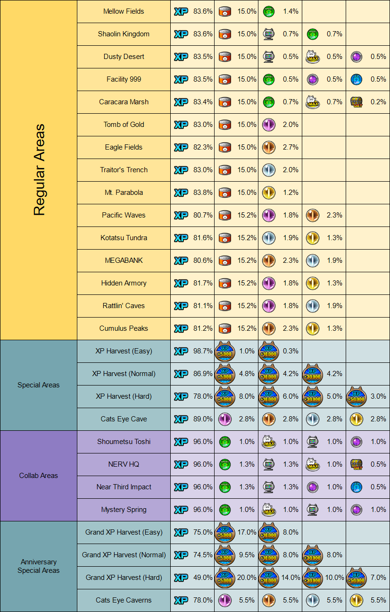
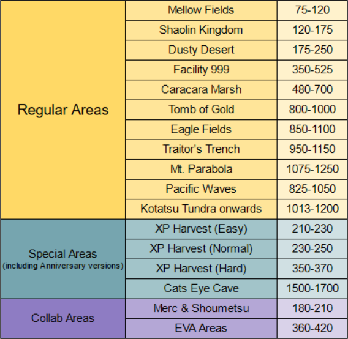
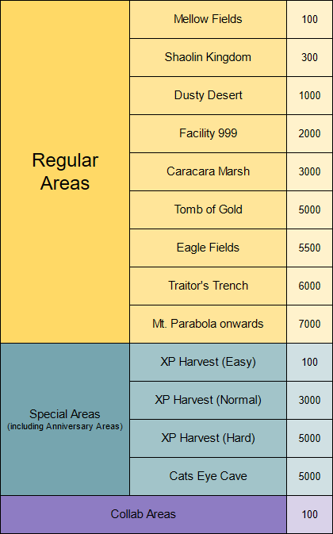
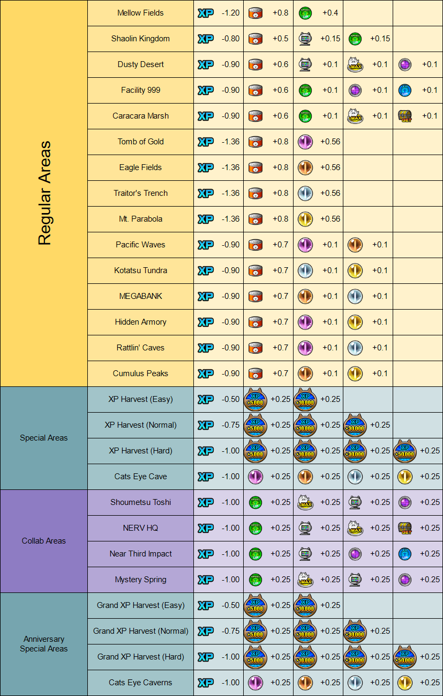

## Key Results Summary

- Expedition length doesn’t matter for item drops, except in Catseye Cave (and XP Harvest, Collab Areas) where shorter expeditions are better.
- For recruiting Helpers, 1h expeditions are best, and you should have 5 Engineers.
- Exactly which area is best for a certain drop depends on your Gamatoto Level, as different areas are affected differently by it.
- To maximise the drops of a specific item, see [Best Area For Each Item](#Best%20Area%20For%20Each%20Item).
- Higher Gamatoto Level reduces XP drops, but increases Cat Food and battle item drops.
- More/better Helpers increase XP and item drops, but not Cat Food drops.
- Use the [Gamatoto Calculator](https://docs.google.com/spreadsheets/d/1_4UTvktg9yiVPHjCZaiqSu2XBtRFPQReOF66sMRm9pA) to experiment for yourself, if you want more than the general rules in this document.

## Foreword and Disclaimers

Gamatoto is a very old part of Battle Cats that has, until recently, been woefully unexplained. Attempts have been made with varying success and accuracy in the past, but no known treatment of the topic before this has made as comprehensive a study as this. This represents about six months of on-and-off work by some of the best analysts in the Battle Cats community.

We can’t be 100% sure any of the mechanics here are perfectly accurate; datamining is often not a source of absolute facts, but instead a matter of guessing what the numbers mean and validating them with comparisons to data. Most of the results here are backed up as being statistically consistent with a test sample of some 700+ expeditions, so we are pretty confident overall. This is the best explanation we currently have, but further
research may change this in future.

Note from Feanor April 2024 : This document requires updating to represent Gamatoto's max level now being 130 (13.3) in the XP table and level-dependent calculations, as well as inclusion of the presence of the new "Raisin' the Bar" area. Various images that were being hosted on discord are now broken links and need recreating or retrieving. If someone would like to work on this, get in touch.

A document of this size invariably contains errors and the original writers do not claim otherwise in this case. Let them know if something is off.

And finally, before we begin, an observation made in the early stages of studying this topic:

**Gamatoto is complicated.**

Don’t say you weren't warned.

## The Basics

#### GAMATOTO Report

The outcomes of a Gamatoto Expedition are described in the GAMATOTO Report Screen shown above. We begin with some observations about it.

1. Each line is either yellow or white depending on if a drop was obtained or not.
2. The number of lines you get depends on the expedition's length.

| Expedition Length | Number of Lines |
| ----------------- | --------------- |
| 1 hour            | 6               |
| 3 hours           | 18              |
| 6 hours           | 36              |

3. You can get different amounts of the same drop on different lines
   (e.g., Cat Food×1, Cat Food×2 ; XP+1115, XP+1050)

Other things like what the different white lines say, which Helpers' names comes up, and the time it shows for each line, are random choices shown for style and do not have any useful meaning.

#### Lines and Number of Drops

Each line in the GAMATOTO Report is an independent chance to get any of the potential drops in the area. First, the game rolls to check which item you can get on that line. The base chance to choose each item depends on the area. See a table of these chances in [Appendix A: Item Choice Base Rates](#Appendix%20A%20Item%20Choice%20Base%20Rates).

For example, we can look at Traitor’s Trench:

| Traitor's Trench   |          |
| ------------------ | -------- |
| Item               | Choice % |
| XP                 | 83%      |
| Cat Food           | 15%      |
| Super Rare Catseye | 2%       |

These probabilities always sum to 100%, as every line is assigned one of these item drops. However, there is a second check to determine if you actually get the item. The base chance to get an item is 32%, and it is increased by your Helpers (as described in [Advanced Details](#Advanced%20Details)). When this check succeeds, you get a Yellow Line and the item chosen in the previous step. If instead this check fails, you get a randomly generated White Line and no item.

1. Randomly choose which item to try for (rates depend on area)
2. Randomly choose if you get the item or not
   1. 32% chance of getting the item
   2. 68% chance of White Line instead

With this, we can multiply the chance that the item is chosen with the chance of actually succeeding in getting it, which gives us the chance that any individual line will drop a particular item.

| Traitor's Trench   |          |              |                          |
| ------------------ | -------- | ------------ | ------------------------ |
| Item               | Choice % | Success Rate | Chance For Drop Per Line |
| XP                 | 83%      | 32%          | 26.56%                   |
| Cat Food           | 15%      | 32%          | 4.80%                    |
| Super Rare Catseye | 2%       | 32%          | 0.64%                    |
| White Text Line    |          |              | 68%                      |

To then calculate the average number of drops across a whole expedition, we multiply these Drop Per Line chances by the number of lines you get (6, 18 or 36 depending on the length of the expedition).

| Traitor's Trench   |                 |                             |                             |                             |
| ------------------ | --------------- | --------------------------- | --------------------------- | --------------------------- |
| Item               | Chance Per Line | Average Drops 1h Expedition | Average Drops 3h Expedition | Average Drops 6h Expedition |
| XP                 | 26.56%          | 1.59                        | 4.78                        | 9.56                        |
| Cat Food           | 4.80%           | 0.29                        | 0.86                        | 1.73                        |
| Super Rare Catseye | 0.64%           | 0.038                       | 0.12                        | 0.23                        |
| White Text Line    | 68%             | 4.08                        | 12.24                       | 24.48                       |

That is, the GAMATOTO Report for an average 6 hour expedition to Traitor’s Trench will have about 24 White Text Lines, 10 XP drops, 2 Cat Food drops, and no Catseyes, for a total of 36.

#### Drop Amounts and Caps

So when you get a drop of an item, how many do you get?

This also depends on the item and area. Each item has a minimum and a maximum drop amount, and all values in that range are equally likely.

The rules for drop numbers are:

- Cat Food always drops either 1 or 2 per line.
- Regular XP drops have a large range (e.g. 950-1150 per line) that increases as you go to higher level areas.
  These are tabulated in [Appendix B: XP Ranges Dropped Per Line](#Appendix%20B%20XP%20Ranges%20Dropped%20Per%20Line).
- Bulk XP drops in XP Harvest Areas (e.g. XP +10,000) always drop only 1 per line.
- Catseyes always drop 1 per line.
- Battle Items drop 1 per line, except in Evangelion Areas where they drop 2 per line.

Using this information, taking a 3 hour expedition in Traitor’s Trench with the above data as an example, we find the average amount of each item dropped per expedition (multiplying the average number of successful drops / yellow lines by the average amount of each drop) to be:

| Traitor's Trench 3h Expedition |                      |            |                       |                              |
| ------------------------------ | -------------------- | ---------- | --------------------- | ---------------------------- |
| Item                           | Average Yellow Lines | Range      | Average Drop Per Line | Average Drop Over Expedition |
| XP                             | 4.78                 | 950 - 1150 | 1050                  | 5020                         |
| Cat Food                       | 0.86                 | 1 - 2      | 1.5                   | 1.30                         |
| Super Rare Catseye             | 0.12                 | 1          | 1                     | 0.12                         |

However, each item type in each area also potentially has a cap. If your total drops of the item exceed the cap, the excess will be lost.

The rules for caps are:

- Cat Food always has a cap of **9** per expedition.
- Regular XP drops are **unlimited**.
- Bulk XP drops in XP Harvest Areas are **unlimited**, except the highest amount in the area which has a cap of **1**.
- Catseyes are **unlimited**, except in Catseye Cave (and Caverns) where they have a cap of **1** each.
- Battle Items are **unlimited**, except in Collab Areas where they have a cap of **1**, or for Evangelion Areas **2** each.

For example, if you get 5 drops of Cat Food ×2 in a single expedition, this exceeds the cap of 9, and so you only get 9 Cat Food from the expedition.

#### Inari and Collab Helpers

Having Inari from the Cat Shrine present **doubles** the drop amount of items (except for Cat Food) for a single expedition. That is, the chance of each line dropping an item stays the same, but you get twice as many as usual (e.g. 2 Catseyes per line) when successful. Certain collabs (Merc, Shoumetsu, Miku) also have bonus helpers who act as a permanent Inari (you can’t have both at once), having the same effect on your drops.

These also double the caps on the relevant items. (Catseye Cave can now drop **2** of each Catseye!)

#### Engineers and Helpers

At the end of an expedition, Gamatoto has a chance to find a helper. The rates differ between Early Game and Regular expedition areas, defined here as:

|            |                                                                                      |
| ---------- | ------------------------------------------------------------------------------------ |
| Early Game | Mellow Fields Shaolin Kingdom Dusty Desert XP Harvest (Easy) Grand XP Harvest (Easy) |
| Regular    | All other normal, event and collab areas.                                            |

The chance to find a Helper in an area depends on which of these categories you are in, the length of the expedition, and whether or not you have a full team of 5 Engineers.

First, the area you are in determines the Base Helper Chance:

- For Early Game areas, the Base Helper Chance is **7.5%**.
- For Regular areas, the Base Helper Chance is **9%**.

Next, the expedition length determines how many Attempts Gamatoto has at finding a helper:

- 1 hour expeditions have **2** Attempts.
- 3 hour expeditions have **5** Attempts.
- 6 hour expeditions have **9** Attempts.

The chance of each Attempt succeeding is the Base Helper Chance above. If it succeeds, then you get a helper. If it fails, you move onto the next attempt and repeat. If you run out of attempts with no Helper drops, you get no helpers for that expedition.

If an attempt succeeds, the chance of it being each type of helper is as follows:

| Type       | Early Game | Regular |
| ---------- | ---------- | ------- |
| Engineer\* | 86.67%     | 86.67%  |
| White      | 9.73%      | 7.73%   |
| Bronze     | 2.13%      | 3.20%   |
| Silver     | 1.07%      | 1.60%   |
| Gold\*\*   | 0.4%       | 0.8%    |

\*If you have 5 Engineers present already, you cannot get more, so the current Attempt "fails" and you move on to the next Attempt.

\*\*Note that when Legendary Helpers are unlocked, you get them instead of Gold Helpers at the same rate. In other words, all drops that would otherwise be Gold Helpers become Legendary instead.

Putting all of this together, we can calculate the chance of any given expedition giving each rarity of helper:

From this, we can see that doing more **shorter expeditions** will yield more helpers on average than doing fewer longer ones. For example, six 1h expeditions in a regular area with full engineers will give six 0.14% chances at a Gold helper (average 0.84 dropped total) while one 6h expedition will yield just one 0.62% chance (average 0.62 dropped total) making the shorter expeditions about 35% better.

In fact, even if you are inattentive and in a 6 hour span only manage to send out **four or five 1h expeditions**, this will still yield an average of 0.56 to 0.70 gold helpers, which is still slightly better than the 6h case.

#### Levelling Up Gamatoto

Gamatoto begins his life at Level 1, and with every expedition, gains Experience Points which allow him to level up. This changes the chances of choosing each item for a line and is explained in [Effect of Gamatoto Level](#Effect%20of%20Gamatoto%20Level). It also unlocks new areas and costumes.

Higher level Gamatoto areas drop more Gamatoto Experience, tabulated in [Appendix C: Gamatoto Experience](#Appendix%20C%20Gamatoto%20Experience), and longer expeditions also increase the amount as follows:

| Expedition Length | Gamatoto Experience Multiplier | Efficiency |
| ----------------- | ------------------------------ | ---------- |
| 1 hour            | 1×                             | 100%       |
| 3 hours           | 2.75×                          | 92%        |
| 6 hours           | 5.5×                           |            |

That is, if you wish to maximise the rate at which Gamatoto gains Experience to level up, doing multiple 1 hour expeditions is slightly better than 3 or 6 hour expeditions.

Additionally, sometimes (20% chance) Gamatoto will randomly gain a bonus 50% Experience (×1.5) for expeditions.

The cumulative experience Gamatoto needs to reach a given level is as follows:

| Level | XP To Next  |
| ----- | ----------- |
| 1     | 600         |
| 2     | 2,400       |
| 3     | 10,900      |
| 4     | 16,900      |
| 5     | 23,000      |
| 6     | 44,100      |
| 7     | 65,300      |
| 8     | 86,500      |
| 9     | 107,700     |
| 10    | 168,200     |
| 11    | 228,700     |
| 12    | 289,200     |
| 13    | 349,700     |
| 14    | 444,000     |
| 15    | 538,400     |
| 16    | 632,800     |
| 17    | 727,200     |
| 18    | 821,600     |
| 19    | 1,003,100   |
| 20    | 1,184,600   |
| 21    | 1,366,100   |
| 22    | 1,547,600   |
| 23    | 1,729,100   |
| 24    | 1,917,600   |
| 25    | 2,106,200   |
| 26    | 2,294,700   |
| 27    | 2,483,300   |
| 28    | 2,671,800   |
| 29    | 2,860,400   |
| 30    | 3,102,400   |
| 31    | 3,344,400   |
| 32    | 3,586,400   |
| 33    | 3,828,400   |
| 34    | 4,070,400   |
| 35    | 4,312,400   |
| 36    | 4,590,700   |
| 37    | 4,869,000   |
| 38    | 5,147,300   |
| 39    | 5,425,600   |
| 40    | 5,703,900   |
| 41    | 5,982,200   |
| 42    | 6,260,500   |
| 43    | 6,575,100   |
| 44    | 6,889,700   |
| 45    | 7,204,300   |
| 46    | 7,518,900   |
| 47    | 7,833,500   |
| 48    | 8,148,100   |
| 49    | 8,462,700   |
| 50    | 8,822,700   |
| 51    | 9,182,600   |
| 52    | 9,509,300   |
| 53    | 9,836,000   |
| 54    | 10,162,800  |
| 55    | 10,489,500  |
| 56    | 10,816,200  |
| 57    | 11,142,900  |
| 58    | 11,528,500  |
| 59    | 11,914,200  |
| 60    | 12,299,900  |
| 61    | 12,685,600  |
| 62    | 13,071,300  |
| 63    | 13,457,000  |
| 64    | 13,842,700  |
| 65    | 14,228,400  |
| 66    | 14,614,000  |
| 67    | 15,088,320  |
| 68    | 15,562,640  |
| 69    | 16,036,960  |
| 70    | 16,511,280  |
| 71    | 16,985,600  |
| 72    | 17,569,380  |
| 73    | 18,153,160  |
| 74    | 18,736,940  |
| 75    | 19,320,720  |
| 76    | 19,904,500  |
| 77    | 20,539,750  |
| 78    | 21,175,000  |
| 79    | 21,810,250  |
| 80    | 22,445,500  |
| 81    | 23,080,750  |
| 82    | 23,716,000  |
| 83    | 24,630,760  |
| 84    | 25,545,520  |
| 85    | 26,460,280  |
| 86    | 27,375,040  |
| 87    | 28,289,800  |
| 88    | 29,277,967  |
| 89    | 30,266,133  |
| 90    | 31,254,300  |
| 91    | 32,242,467  |
| 92    | 33,230,633  |
| 93    | 34,218,800  |
| 94    | 35,376,367  |
| 95    | 36,533,933  |
| 96    | 37,691,500  |
| 97    | 38,849,067  |
| 98    | 40,006,633  |
| 99    | 41,164,200  |
| 100   | 43,000,000  |
| 101   | 44,835,800  |
| 102   | 46,671,600  |
| 103   | 48,507,400  |
| 104   | 50,343,200  |
| 105   | 52,179,000  |
| 106   | 54,014,800  |
| 107   | 55,850,600  |
| 108   | 57,784,600  |
| 109   | 59,718,600  |
| 110   | 61,652,600  |
| 111   | 63,586,600  |
| 112   | 65,520,600  |
| 113   | 67,454,600  |
| 114   | 69,388,600  |
| 115   | 71,322,600  |
| 116   | MAX (v10.7) |

## Advanced Details

#### Effect of Gamatoto Level

Levelling up Gamatoto **increases** the Item Choice Rate of Cat Food, Catseyes, Battle Items and Bulk XP Drops (XP Harvest 10k XP, etc), while **decreasing** that of regular XP drops.

Each item in each area has a "Choice Rate Modifier" which indicates how much the Choice Rate of that item changes for a given Gamatoto Level. To be specific:

\***Final Choice Rate** = Base Choice Rate + Choice Rate Modifier × Level Factor\*

where _Base Choice Rate_ is the value discussed in the previous section (and found in [Appendix A: Item Choice Base Rates](#Appendix%20A%20Item%20Choice%20Base%20Rates)), the Choice Rate Modifier is found in [Appendix D: Item Choice Level Modifiers](#Appendix%20D%20Item%20Choice%20Level%20Modifiers), and the Level Factor is a number that increases as Gamatoto Levels up, which is given by:

_Level Factor = 0.02% × (Gamatoto Level - 1)_ for Gamatoto Level 1 to 99
and
_Level Factor = 2% + (0.02% × Gamatoto Level)_ for Gamatoto Level 100+

To be clear, it is 0% at Level 1, and increases by 0.02% per level until reaching 1.96% at Level 99. At Level 100, it suddenly becomes much larger and jumps to 4%, then continues increasing by 0.02% per level.

For example, going back to the case of Traitor’s Trench from [before](#Lines%20and%20Number%20of%20Drops), for a Level 100 Gamatoto:

| Traitor's Trench At Level 100 Gamatoto (Level Factor 4%) |                     |                                        |                   |                              |
| -------------------------------------------------------- | ------------------- | -------------------------------------- | ----------------- | ---------------------------- |
| **Item**                                                 | **Choice Modifier** | **Choice % + modifier × Level Factor** | **Success Rate**  | **Chance For Drop Per Line** |
| XP                                                       | -1.36               | 83% – 1.36 × 4% = 77.56%               | 32%               | 26.56% ➙ **24.82%**          |
| Cat Food                                                 | +0.8                | 15% + 0.8 × 4% = 18.2%                 | 4.80%➙ **5.82%**  |                              |
| Super Rare Catseye                                       | +0.56               | 2% + 0.56 × 4% = 4.24%                 | 0.64% ➙ **1.36%** |                              |
| White Text Line                                          |                     |                                        |                   | 68%                          |

Note that the total chance of getting an item at all is still bound to the 32% success rate — you still get the same number of White and Yellow lines — increasing Gamatoto’s Level only turns some amount of your drops that would have previously been XP into Cat Food or other items in the area.

Converting these modified rates into average drops per expedition, we then find:

|                                                          |                     |                   |                 |                 |
| -------------------------------------------------------- | ------------------- | ----------------- | --------------- | --------------- |
| Traitor’s Trench At Level 100 Gamatoto (Level Factor 4%) |                     |                   |                 |                 |
| Item                                                     | Chance Per Line     | Average Drops     | 1h Expedition   | Average Drops   |
| XP                                                       | 26.56% ➙ **24.82%** | 1.59 ➙ **1.49**   | 4.78 ➙ **4.47** | 9.56 ➙ **8.93** |
| Cat Food                                                 | 4.80% ➙ **5.82%**   | 0.29 ➙ **0.35**   | 0.86 ➙ **1.05** | 1.73 ➙ **2.10** |
| Super Rare Catseye                                       | 0.64% ➙ **1.36%**   | 0.038 ➙ **0.081** | 0.12 ➙ **0.24** | 0.23 ➙ **0.49** |
| White Text Line                                          | 68%                 | 4.08              | 12.24           | 24.48           |

And then the average amounts of each item from those drops in a 3h Expedition:

|                                                                     |                      |            |                       |                              |
| ------------------------------------------------------------------- | -------------------- | ---------- | --------------------- | ---------------------------- |
| Traitor’s Trench 3h Expedition Level 100 Gamatoto (Level Factor 4%) |                      |            |                       |                              |
| Item                                                                | Average Yellow Lines | Range      | Average Drop Per Line | Average Drop Over Expedition |
| XP                                                                  | 4.78 ➙ **4.47**      | 950 - 1150 | 1050                  | 5020 ➙ **4691**              |
| Cat Food                                                            | 0.86 ➙ **1.05**      | 1 - 2      | 1.5                   | 1.29 ➙ **1.57**              |
| Super Rare Catseye                                                  | 0.12 ➙ **0.24**      | 1          | 1                     | 0.12 ➙ **0.24**              |

We see that because the Choice Rate modifier for Catseyes is so high compared to the base Choice Rate, increasing Gamatoto Level to 100 effectively doubles the number you will get from expeditions in this area compared to Level 1 Gamatoto. Although it has a less pronounced effect on the other items, since the modifier is a smaller fraction of the base rate, giving you about 20% more cat food and 6% less XP. All in all, a good
tradeoff!

#### Effect of Helpers

Each Helper you recruit has a Helper Score depending on their rarity/colour:

| Rarity    | Helper Score |
| --------- | ------------ |
| White     | 1            |
| Bronze    | 2            |
| Silver    | 4            |
| Gold      | 6            |
| Legendary | 7            |

The amount your helpers affect your Gamatoto Expeditions is dependent on the sum of your Helpers’ Scores. This is a number between 0 (no helpers) and 70 (ten Legendary Helpers). Each point of Helper Score adds **0.27%** to the base Success Rate (32%) of obtaining an item after it is selected on a line.

**\*Final Success Rate** = 32% + (Helper Score × 0.27%)\*

For example, with 10 Gold Helpers, your Helper Score is 10×6 = 60, and your Final Success Rate is 32% + (60 × 0.27%) = **48.2%**.

This means that you get **fewer White Lines** and **more Yellow Lines**. Unlike the effect of increasing Gamatoto’s Level, Helpers actually give you more drops in total, not just shift the ratios of one drop to another.

However, there is an exception to this: Cat Food.

#### Effect of Helpers on Cat Food

The success rate for Cat Food technically increases by 0.27% per point of Helper Score too, but a second effect also occurs. Each point of Helper Score’s 0.27% extra chance for a Cat Food drop is cancelled out by adding a chance for Cat Food drops to turn into XP drops. In effect, this means that the Cat Food success rate stays at 32%, but an extra source of XP is added to the drop table, like this:

|                                                         |                        |                                          |                          |
| ------------------------------------------------------- | ---------------------- | ---------------------------------------- | ------------------------ |
| Traitor’s Trench With 10 Gold Helpers (60 Helper Score) |                        |                                          |                          |
| Item                                                    | Choice %               | Base Success Rate + Helper Score × 0.27% | Chance For Drop Per Line |
| XP                                                      | 83%                    | 32% + 60 × 0.27% = **48.2%**             | 26.56% ➙ **40%**         |
| Cat Food                                                | 15%                    | 32%                                      | **4.80%**                |
| Cat Food ➙ XP                                           | 60 × 0.27% = **16.2%** | **2.43%**                                |                          |
| Super Rare Catseye                                      | 2%                     | 32% + 60 × 0.27% = **48.2%**             | 0.64% ➙ **0.96%**        |
| White Text Line                                         |                        |                                          | 68% ➙ **51.8%**          |

That is, now the total Chance of an XP Drop Per Line is 40% from direct XP drops + 2.43% from additional Cat Food being turned into XP, so **42.43%**.

Turning this into expected drops per expedition type:

|                                                         |                     |                   |                  |                   |
| ------------------------------------------------------- | ------------------- | ----------------- | ---------------- | ----------------- |
| Traitor’s Trench With 10 Gold Helpers (60 Helper Score) |                     |                   |                  |                   |
| Item                                                    | Chance Per Line     | Average Drops     | 1h Expedition    | Average Drops     |
| XP (incl. CF ➙ XP)                                      | 26.56% ➙ **42.43%** | 1.59 ➙ **2.55**   | 4.78 ➙ **7.64**  | 9.56 ➙ **15.27**  |
| Cat Food                                                | **4.80%**           | 0.29              | 0.86             | 1.73              |
| Super Rare Catseye                                      | 0.64% ➙ **0.96%**   | 0.038 ➙ **0.058** | 0.12 ➙ **0.17**  | 0.23 ➙ **0.35**   |
| White Text Line                                         | 68% ➙ **51.8%**     | 4.08 ➙ **3.11**   | 12.24 ➙ **9.32** | 24.48 ➙ **18.65** |

and then the average amount of each item per 3h expedition.

|                                                                       |                      |            |                       |                              |
| --------------------------------------------------------------------- | -------------------- | ---------- | --------------------- | ---------------------------- |
| Traitor’s Trench 3h Expedition With 10 Gold Helpers (60 Helper Score) |                      |            |                       |                              |
| Item                                                                  | Average Yellow Lines | Range      | Average Drop Per Line | Average Drop Over Expedition |
| XP (incl. CF ➙ XP)                                                    | 4.78 ➙ **7.64**      | 950 - 1150 | 1050                  | 5020 ➙ **8019**              |
| Cat Food                                                              | 0.86                 | 1 - 2      | 1.5                   | 1.30                         |
| Super Rare Catseye                                                    | 0.12 ➙ **0.17**      | 1          | 1                     | 0.12 ➙ **0.17**              |

We see that the main effect here is to increase the XP drop, due to both increasing the success chance for it, and converting some Cat Food into extra XP, though Catseyes are also respectably boosted.

We conclude this section by noting that with both a higher Gamatoto Level, and a higher Helper Score, the net effect will be to increase everything. With Level 100 Gamatoto and 10 Gold Helpers, the combination of the effects of [Gamatoto Level](#Effect%20of%20Gamatoto%20Level) and [helpers](#Effect%20of%20Helpers) will be:

|                                                                                                                |                      |            |                       |                              |
| -------------------------------------------------------------------------------------------------------------- | -------------------- | ---------- | --------------------- | ---------------------------- |
| Traitor’s Trench 3h Expedition With Level 100 Gamatoto (Level Factor 4%) and 10 Gold Helpers (60 Helper Score) |                      |            |                       |                              |
| Item                                                                                                           | Average Yellow Lines | Range      | Average Drop Per Line | Average Drop Over Expedition |
| XP (incl. CF ➙ XP)                                                                                             | 4.78 ➙ **7.26**      | 950 - 1150 | 1050                  | 5020 ➙ **7622**              |
| Cat Food                                                                                                       | 0.86 ➙ **1.05**      | 1 - 2      | 1.5                   | 1.29 ➙ **1.57**              |
| Super Rare Catseye                                                                                             | 0.12 ➙ **0.37**      | 1          | 1                     | 0.12 ➙ **0.37**              |

The Catseye drop is enhanced by both Level and Helper bonuses to be triple its base value, the Cat Food is only enhanced by Level, and the XP is enhanced by Helpers but decreased by Level (though still increases overall).

#### Cap Corrections

In the [The Basics](#The%20Basics) section and then later in [Effect of Gamatoto Level](#Effect%20of%20Gamatoto%20Level) and [Effect of Helpers](#Effect%20of%20Helpers), we obtained final average amounts per expedition by multiplying the average number of successful lines by the average drop per line. However, as explained above, some items have a Cap on the maximum number you can obtain from a single expedition. While the above calculations are correct in the case of no cap (XP, Catseyes in regular areas...), they are inaccurate in the case of capped amounts (Cat Food, Catseyes in Catseye Cave...) as they do not factor it in.

Take for example, an **Imaginary Gamatoto Area** which only drops **Imaginary Catseyes**. Each line has a 50% chance to drop one. In a 1 hour expedition (6 lines), you would then expect (50% × 6) or **3 Imaginary Catseyes** if there was **no cap**.

However, if there is a Cap of 1, then clearly this is not possible. To then calculate the average, we have to consider the probability of _n_ lines yielding a Catseye using the
[binomial distribution](https://en.wikipedia.org/wiki/Binomial_distribution).

| n   | Chance                               | Catseyes Gained | Catseyes × Chance |
| --- | ------------------------------------ | --------------- | ----------------- |
| 0   | (1 - 0.5)6 = **1.6%**                | 0               | 0                 |
| 1   | 6 × (1 - 0.5)5 × (0.5)1 = **9.4%**   | 1               | 0.094             |
| 2   | 15 × (1 - 0.5)4 × (0.5)2 = **23.4%** | 2               | 0.47              |
| 3   | 20 × (1 - 0.5)3 × (0.5)3 = **31.3%** | 3               | 0.94              |
| 4   | 15 × (1 - 0.5)2 × (0.5)4 = **23.4%** | 4               | 0.94              |
| 5   | 6 × (1 - 0.5)1 × (0.5)5 = **9.4%**   | 5               | 0.47              |
| 6   | (0.5)6 = **1.6%**                    | 6               | 0.094             |
| Sum |                                      |                 | 3.00              |

The _Expectation Value_ (average) number of Imaginary Catseyes is then equal to the sum over each possibility (_n_ = 0 to 6) of the chance of that possibility multiplied by the number of Catseyes you get in that event, which comes out to 3, the same as just doing (50% × 6) as expected.

Now, consider the same area, but with a Cap of 1 on Imaginary Catseyes:

| n   | Chance                               | Catseyes Gained   | Catseyes × Chance |
| --- | ------------------------------------ | ----------------- | ----------------- |
| 0   | (1 - 0.5)6 = **1.6%**                | 0                 | 0                 |
| 1   | 6 × (1 - 0.5)5 × (0.5)1 = **9.4%**   | 1                 | 0.094             |
| 2   | 15 × (1 - 0.5)4 × (0.5)2 = **23.4%** | 2 capped to **1** | 0.23              |
| 3   | 20 × (1 - 0.5)3 × (0.5)3 = **31.3%** | 3 capped to **1** | 0.31              |
| 4   | 15 × (1 - 0.5)2 × (0.5)4 = **23.4%** | 4 capped to **1** | 0.23              |
| 5   | 6 × (1 - 0.5)1 × (0.5)5 = **9.4%**   | 5 capped to **1** | 0.094             |
| 6   | (0.5)6 = **1.6%**                    | 6 capped to **1** | 0.016             |
| Sum |                                      |                   | 0.98              |

This clearly reduces the expectation value of the number of Catseyes gained per expedition.

This is only really of consequence for **Catseye Cave** where each Catseye has a cap of 1, which you will realistically reach often. The cap of 9 on Cat Food only very slightly affects the average Cat Food gained as the probability of gaining over 9 in a single expedition is low anyway. The Battle Items in collab areas, and the XP Harvest biggest drops are also affected by this, but are rarely used for farming.

The main consequence of this is that as 1h, 3h and 6h expeditions all have the same cap, **six 1h expeditions will yield more Catseyes in Catseye Cave** than either two 3h expeditions or one 6h expedition on average. In regular areas with unlimited caps, all expedition lengths are essentially equal, but for farming Catseye Cave you should prioritise 1h expeditions whenever possible.

The exact amount of improvement doing 6×1h vs 1×6h depends on the area, your Gamatoto Level and your Helper Score, but for a nominal Catseye drop rate of about 2% per line, doing the six short expeditions will get you about 30% more Catseyes on average than a single long one.

Intuitively, this is obvious from the fact that if you do six 1h expeditions each with a cap of 1, you might get 2, 3, 4, 5 or 6 total, but the single 6h expedition still with a cap of 1 can only yield 1 or 0. Even though the long expedition is more likely to yield 1, the small chance that you can get more than 1 from multiple short expeditions outweighs the higher rates of the 6h expedition.

The full analysis of this for Cat Food with a cap of 9 is much more complicated, as unlike with a cap of 1, there are multiple ways to achieve a cap of 9. You could get 9 drops of 1 Cat Food, or three drops of 2 Cat Food and three drops of 1 Cat Food, etc, and enumerating all these possibilities requires [Appendix E: The General Formula For Capped Drops](#Appendix%20E%20The%20General%20Formula%20For%20Capped%20Drops).

## Best Area For Each Item

So what is the best area to get Super Rare Catseyes? Or Cat Food?

Putting together everything we’ve learned, the answer is it depends on your Gamatoto Level and Helper Score.

For example, for Super Rare Catseyes, the following graph illustrates the main points:

Along the x-axis is your Gamatoto Level from 1 to 116, and the y-axis is the average number of SR Catseyes dropped. Each shaded region represents the range of averages you can get for different Helper levels. Note the following:

- At **low Gamatoto Level**, **Catseye Cave (1h expedition)** is the best, and the Single Catseye Area (Traitor’s Trench) and the Multi Catseye Areas (MEGABANK etc) are about equal.
- For Catseye Cave 3h or 6h, it will do worse than 1h as discussed in Cap Corrections. If you are serious about optimising your Catseye drops you should not be considering these as options, but it will sometimes be better, sometimes be worse, than the Single Area.
- At Gamatoto Level high but less than 100, the Single Area improves to be comparable with Catseye Cave, while the Multi Areas remain bad.
- For **Gamatoto Levels 100** and up, the **Single Catseye Area** becomes the best.
- This is only accounting for Super Rare eye drops, not other types.
- The Helper Level does not really matter; it affects all areas approximately equally.

The main factor here is that the Single Catseye area has a much higher Item Choice Level Modifier than the others, so the drop rate of SR Catseyes there increases faster with growing Gamatoto level.

#### XP and Battle Items

Please do not use Gamatoto to farm these.

#### Cat Food

|                |                                                                                              |                                                                                                                                                                                                |
| -------------- | -------------------------------------------------------------------------------------------- | ---------------------------------------------------------------------------------------------------------------------------------------------------------------------------------------------- |
| Cat Food Drops |                                                                                              |                                                                                                                                                                                                |
| Levels         | Best Areas                                                                                   | Reason                                                                                                                                                                                         |
| 1 - 99         | _ Pacific Waves _ Kotatsu Tundra _ MEGABANK _ Hidden Armory _ Rattlin' Caves _ Cumulus Peaks | **Two-Catseye Areas** have the highest base CF choice rate at 15.2% and win at low Gamatoto Levels                                                                                             |
| 100 - 116      | _ Mellow Fields _ Tomb of Gold _ Eagle Fields _ Traitor's Trench \* Mt. Parabola             | **One-Catseye Areas** (and **Mellow Fields** weirdly) have lower base CF choice rates at 15.0% but they have the highest CF Modifiers at +0.8 and thus give the most CF at high Gamatoto Level |

#### Special Catseyes

|                                                                                          |                                                                                            |                                                                                                                                              |
| ---------------------------------------------------------------------------------------- | ------------------------------------------------------------------------------------------ | -------------------------------------------------------------------------------------------------------------------------------------------- |
| Special Catseye Drops                                                                    |                                                                                            |                                                                                                                                              |
| Levels                                                                                   | Best Areas                                                                                 | Reason                                                                                                                                       |
| 1 - 99                                                                                   | 1. **Catseye Cave (1h)** 2. Tomb of Gold 3. Pacific Waves / Hidden Armory / Rattlin’ Caves | **Catseye Cave** has the highest base Catseye choice rate (2.8%), followed by the One-Catseye Area (2.0%), then the Two-Catseye Areas (1.8%) |
| 100 - 116                                                                                | 1. **Tomb of Gold** 2. Catseye Cave 3. Pacific Waves / Hidden Armory / Rattlin’ Caves      | The **One-Catseye Area** has a huge +0.56 modifier, compared to Catseye Cave’s +0.25 and the Two Catseye Areas’ mere +0.10                   |
| Note: 1h Catseye Caverns (Anniversary) is always the best area but is not included above |                                                                                            |                                                                                                                                              |

#### Rare Catseyes

|                                                                                          |                                                                                 |                                                                                                                                                                                           |
| ---------------------------------------------------------------------------------------- | ------------------------------------------------------------------------------- | ----------------------------------------------------------------------------------------------------------------------------------------------------------------------------------------- |
| Rare Catseye Drops                                                                       |                                                                                 |                                                                                                                                                                                           |
| Levels                                                                                   | Best Areas                                                                      | Reason                                                                                                                                                                                    |
| 1 - 116                                                                                  | 1. **Eagle Fields** 2. Catseye Cave 3. Pacific Waves / MEGABANK / Cumulus Peaks | Catseye Cave has the highest base Catseye choice rate (2.8%), but the **One-Catseye Area** is only slightly less (2.7%) and isn’t capped, but the Two-Catseye Areas (2.3%) is still worse |
| Note: 1h Catseye Caverns (Anniversary) is always the best area but is not included above |                                                                                 |                                                                                                                                                                                           |

##### Super Rare Catseyes

|                                                                                          |                                                                                            |                                                                                                                                              |
| ---------------------------------------------------------------------------------------- | ------------------------------------------------------------------------------------------ | -------------------------------------------------------------------------------------------------------------------------------------------- |
| Super Rare Catseye Drops                                                                 |                                                                                            |                                                                                                                                              |
| Levels                                                                                   | Best Areas                                                                                 | Reason                                                                                                                                       |
| 1 - 99                                                                                   | 1. **Catseye Cave (1h)** 2. Traitor’s Trench 3. Kotatsu Tundra / MEGABANK / Rattlin’ Caves | **Catseye Cave** has the highest base Catseye choice rate (2.8%), followed by the One-Catseye Area (2.0%), then the Two-Catseye Areas (1.8%) |
| 100 - 116                                                                                | 1. **Traitor's Trench** 2. Catseye Cave 3. Kotatsu Tundra / MEGABANK / Rattlin’ Caves      | The **One-Catseye Area** has a huge +0.56 modifier, compared to Catseye Cave’s +0.25 and the Two Catseye Areas’ mere +0.10                   |
| Note: 1h Catseye Caverns (Anniversary) is always the best area but is not included above |                                                                                            |                                                                                                                                              |

##### Uber Rare Catseyes

|                                                                                          |                                                                                            |                                                                                                                                                                                                                                       |
| ---------------------------------------------------------------------------------------- | ------------------------------------------------------------------------------------------ | ------------------------------------------------------------------------------------------------------------------------------------------------------------------------------------------------------------------------------------- |
| Uber Rare Catseye Drops                                                                  |                                                                                            |                                                                                                                                                                                                                                       |
| Levels                                                                                   | Best Areas                                                                                 | Reason                                                                                                                                                                                                                                |
| 1 - 99                                                                                   | 1. **Catseye Cave (1h)** 2. Kotatsu Tundra / Hidden Armory / Cumulus Peaks 3. Mt. Parabola | **Catseye Cave** has the highest base Catseye choice rate (2.0%), followed by the Two-Catseye Areas (1.3%), then the One-Catseye Area (1.2%). The One-Catseye Area catches up at Lv 12, before which this area isn’t even unlocked... |
| 100 - 116                                                                                | 1. **Catseye Cave (1h)** 2. Mt. Parabola 3. Kotatsu Tundra / Hidden Armory / Cumulus Peaks | The One-Catseye Area has a huge +0.56 modifier, compared to **Catseye Cave**’s +0.2 but this still isn’t enough to catch up. The Two Catseye Areas’ mere +0.10 gets left in the dust.                                                 |
| Note: 1h Catseye Caverns (Anniversary) is always the best area but is not included above |                                                                                            |                                                                                                                                                                                                                                       |

#### Multiple Catseye Types

If you are in need of **all types of Catseye equally** you get the most total drops from:

**Catseye Cave (1h)** > Two-Catseye Areas > One-Catseye Areas

If you need **two specific types of Catseyes** you almost always get the most drops of those two combined from:

**Catseye Cave (1h)** > Two-Catseye Areas\* > One-Catseye Areas\*

The \* marks here are because there are some tiny exceptions:

- For the combination **Super+Uber**, it is basically equal between doing two runs of Kotatsu Tundra vs one each of Traitor’s Trench and Mt Parabolo if Gamatoto is Level 116. When higher levels of Gamatoto are unlocked, Kotatsu will become slightly worse than doing the respective One-Eye areas.
- For **Special+Uber**, two runs of Hidden Armory is already marginally worse than one each of Tomb of Gold
- Mt Parabola at Level 116.

At **Gamatoto Levels ≥ 100** , the Two-Eye area is technically better or about equal but gives you fewer Uber/Super/Special eyes and more Rares which may not be desirable if you need many Uber eyes but only a few Rares for example. Doing the One-Eye areas gives you more control of what you get, and lets you get more of exactly what you need, so you can do **whichever you prefer** or whatever fits your needs at the time, or a
mixture. It does not matter much.

At **Gamatoto Levels < 100** the **Two-Eye areas win** by a large margin. This is because the sum of their Base Choice rates is far higher than the single areas, but because their Modifiers are so low (two +0.1s instead of one +0.56) they lose most of that advantage by high levels.

Regardless, **Catseye Cave (1h)** is always the best choice for 2 or more types of eye, when it is on.

To summarise:

Make a copy of the [Gamatoto Calculator spreadsheet](https://docs.google.com/spreadsheets/d/1_4UTvktg9yiVPHjCZaiqSu2XBtRFPQReOF66sMRm9pA) to play around with exactly what works best for your level and helper combination if the above general rules are not enough information.

#### Optimal Use Of Catamins

We can relate the value of one type of Catamins to another by how much Cat Food they cost to purchase in the store, even though you shouldn’t actually be wasting Cat Food on them.

| Catamin Type | Cat Food Value (for 3) | Cat Food / Hour |
| ------------ | ---------------------- | --------------- |
| A            | 30                     | 10              |
| B            | 80                     | 8.9             |
| C            | 150                    | 8.3             |

If a Catamin A is used to essentially claim a free 1h expedition, a Catamin B is used for a 3h expedition, and a Catamin C for a 6h expedition, which gives the highest return per Cat Food value? The more expensive Catamins cost less Cat Food per hour, but sometimes shorter expeditions are better, so what is most efficient?

For maximising **Regular Drops** (no cap) all expedition lengths are equally profitable and so **Catamin C** with the lowest CF/hour rate is the best choice.

For maximising **Gamatoto XP**, the low CF/hour of **Catamin C** beats the fact that you only get [5.5x the XP](#Levelling%20Up%20Gamatoto) from a 6h expedition compared to a 1h one, so they are again
optimal.

For maximising **Helper Drops**, the fact that you get [much more helpers](#Engineers%20and%20Helpers) from 1h expeditions compared to the others means that even at the higher CF/hour rate, **Catamin A** is the best choice.

Finally, for capped drops in **Catseye Cave**, the balance between [shorter expeditions being more efficient](#Cap%20Corrections) and the CF/hour cost of the Catamins happens to be just such that **Catamin B** are slightly more rewarding than the options either side!

None of these differences are too huge, and you shouldn’t be spending CF on Catamins anyway really, but a wise strategy for spending Catamins in the places they do better than the others might be:

| Catamin Type | Best Way To Use                        |
| ------------ | -------------------------------------- |
| A            | Grinding for Helpers                   |
| B            | Save for Catseye Cave                  |
| C            | Regular Drops, Power-Leveling Gamatoto |

## Other Gamatoto Features

#### Ad Bags

Up to three times per day, a bag will appear on the floor when Gamatoto is not away on an expedition. Opening it requires watching an ad, and it will not reappear until Gamatoto has completed another expedition of any length (and will only appear if an ad is available).

The rates of items from this bag are as follows:

| Item                                      | Rate    |
| ----------------------------------------- | ------- |
| Cat Food ×1                               | 42%     |
| Special, Rare, or Super Rare Catseye ×1   | 6% each |
| Uber Rare Catseye ×1                      | 5%      |
| Building Material (excluding Ammonite) ×1 | 5% each |

#### Shrine Donations

Shrine appears at random around every 2-5 days, and gives you the opportunity to take a [Shrine Fortunes](#Shrine%20Fortunes) for 5 XP, as well as to donate 100k, 1M, 3M or 5M XP to receive an item (up to 5 times each per appearance).

The drop tables are:

When you donate to the Shrine, it levels up depending on how much XP you’ve given it. When it reaches a multiple of Level 10 it disappears. It can also disappear when you leave and re-enter the Gamatoto screen at random (though will sometimes stay until the end of the day too).

In addition to the above drop rates, there is a pity mechanism that every **30th 1M donation** is guaranteed to **drop a Gold Catfruit**. It doesn’t matter if you donate to other tiers in between, or how many shrine appearances you do it over. It doesn’t matter if you get a lucky 1% Gold Fruit in those 30 donations either, the 30th will still be a Gold Fruit.

It is **not** usually recommended to donate XP to Shrine unless you already have most of your important cats at Level 30, at which point you may wish to use the 3M tier for Catseyes.

| Donation Tier | Use When:                                                         |
| ------------- | ----------------------------------------------------------------- |
| 100k          | Never                                                             |
| 1M            | You own Lasvoss and want to True Form him                         |
| 3M            | All good cats are Lv 30+ and you need more Catseyes for late game |
| 5M            | Only if you need Legend Catseyes the most and have spare XP       |

#### Shrine Fortunes

Fortune Slips cost 5 XP and give you one of 6 Luck Ratings (Uber Luck, Super Luck, Li’l Luck, No Luck, Bad Luck, Disaster). Higher luck ratings only affect the chance of getting Inari and Big Bag from your fortune, and do not affect any other Gamatoto events or anything else in the game in any known way.

As with the GAMATOTO Report itself, the white lines in your Fortune are meaningless, and the Yellow Lines describe the actual effect.

| Yellow Line                          | Meaning           |
| ------------------------------------ | ----------------- |
| "God’s servant brings good tidings." | Inari             |
| "Your blessings shall multiply!"     | Big Bag           |
| "Will to fight: RESTORED!            | Gain 1 Leadership |
| "Good fortune will surely come..."   | No Effect         |

Inari’s [effect](#Inari%20and%20Collab%20Helpers) is to double amounts of all non-Cat Food drops for one expedition (so doing 6h is advisable to maximise this effect). The Big Bag changes your next Ad Bag to have the following drop table:

| Item                                                     | Big Bag Rate |
| -------------------------------------------------------- | ------------ |
| Cat Food ×1                                              | 11.2%        |
| Random Catseye ×1 (Special, Rare, Super, Uber or Legend) | 11.1% each   |
| Treasure Radar ×1                                        | 11.1%        |
| Rich Cat ×1                                              | 11.1%        |
| Leadership ×1                                            | 11.1%        |

## Appendix

#### Appendix A: Item Choice Base Rates

#### Appendix B: XP Ranges Dropped Per Line

#### Appendix C: Gamatoto Experience

#### Appendix D: Item Choice Level Modifiers

#### Appendix E: The General Formula For Capped Drops

$$
\sum_{j=\lceil \frac{S}{D} \rceil}^n
\sum_{k=0}^{\lfloor \frac{S-j}{D} \rfloor}
\binom{n}{j}
\binom {j}{k}
(1-p)^{n-j}
\left(\frac{p}{D} \right)^j
(-1)^k
\binom{S-kD-1}{j-1}
$$

This is the probability of getting exactly S (>0) drops from n lines (6,18 or 36) with a drop chance per line of p (including effects of helpers and level), when they can drop 1 to D items per line with equal chance. This can be used to calculate expectation values for Gamatoto Areas with caps without having to enumerate all possible ways of reaching the cap by hand, which is tedious for caps greater than 3 or 4 (relevant for Cat Food Cap = 9).

A document with the derivation of this is [here](https://drive.google.com/file/d/11Vf1kwYS6jwAXSa7MLMaL70iFkR7Me0J).

With the parameters of a 6h expedition (n=36) and Cat Food drops (D = 2) for a typical late game area and Helper build, you might find this predicts around 0.5% less cat food per expedition than the naive calculations which don’t account for cap. Thus, doing 1h expeditions to avoid reaching the Cat Food cap is rather pointless as the difference is minimal.

For Catseye Cave with Cap = 1, the complex approach above is not required as the probability of hitting the cap is simply:

$P(Drops>1) = 1 - P(Drops=0)$

and the resulting expectation value is trivial (if tedious) to compute.

## Credits

**ThanksFëanor**#8162 (writing, analysis, datamining and testing) \
**obafgkm**#7789 (proofreading, datamining and testing) \
**ITstumbler**#1797 (datamining and testing) \
**Waran-Ess**#9801 (web conversion)
