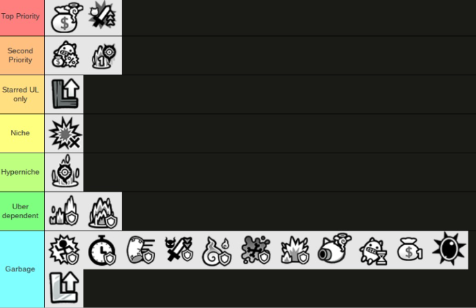

**

## What are Talent Orbs?

Talent Orbs are items which improve a unit’s stats. There are two types of Talents Orbs: Effect Talent Orbs available from stages like Island of Hidden Treasures and the Colossal Gauntlet continuation stages, and Ability Talent Orbs only available from the Extreme Ranking Dojo. Talent Orbs are equipable from the Talent menu and scrolling to the left. Like Talents, Talent Orbs will only apply to a unit’s True Form or Ultra Form. Every unit with Talents has a Talent Orb slot, while specific Ubers with access to Ultra Talents gain a second Talent Orb slot at Level 60. All Ability Talent Orbs are able to stack, while certain Dojo Talent Orbs do not stack and only allows the orb with a higher level to take priority.

- Effect Talent Orbs give units stat improvements against only one trait. 
- Ability Talent Orbs drastically change a unit, from increasing its resistance against an effect (like Slow or Wave) to giving it abilities like creating a Mini-Death Surge when the unit dies, or giving you cash when the unit dies. 

Note that once you equip a Talent Orb, you will have to pay 10 NP to remove the Talent Orb. You can also choose to overwrite the current Orb with one from your collection, which will delete the current Orb.
## About Grades/Ranks

 Talent Orbs have five ranks/grades, ranging from D to S. As you can guess, D-tier Orbs are the worst while S-tier Orbs are the best. You can merge lower tier Orbs to make higher tier ones.  

| Grade | Orbs needed to Merge | NP Value | NP Value (equivalent in D-rank Orbs) | NP Efficiency |
| ----- | -------------------- | -------- | ------------------------------------ | ------------- |
| S     | A x3                 | 25       | 36                                   | 69.44%        |
| A     | B x3                 | 7        | 12                                   | 58.33%        |
| B     | C x2                 | 2        | 4                                    | 50%           |
| C     | D x2                 | 1        | 2                                    | 50%           |
| D     | N/A                  | 1        | 1                                    | 100%          |

# Effect Orbs

## About Effect Orb Types

Effect Orbs come in five types at the time of this writing: Attack Up, Defense Up, Strong Up, Massive Up, and Tough Up. While any unit with Talent Orb slots can equip Attack and Defense Up Orbs, only units with their specific ability are able to equip the Strong Up, Massive Up, and Tough Up Orbs. For example, Fishman Cat, who has Massive vs. Floating, can equip a Massive vs. Floating Up Orb, but would not be able to equip a Massive vs. Red Orb or a Strong vs. Floating Orb. 

Effect Orbs come in 9 Traits: Red, Floating, Dark, Angel, Metal, Angel, Alien, Zombie, Relic, and Aku. Metal Orbs only have the Defense Up Orb unlocked, while Traitless Orbs are currently not in the game at all.
## About Effect Orb Effects

| Grade | Attack Up    | Defense Up  | Strong Up                    | Massive Up   | Tough Up    |
| ----- | ------------ | ----------- | ---------------------------- | ------------ | ----------- |
| S     | +500% damage | -20% damage | +0.3x damage, -0.1x damage   | +0.5x damage | -25% damage |
| A     | +400% damage | -16% damage | +0.24x damage, -0.08x damage | +0.4x damage | -20% damage |
| B     | +300% damage | -12% damage | +0.18x damage, -0.06x damage | +0.3x damage | -15% damage |
| C     | +200% damage | -8% damage  | +0.12x damage, -0.04x damage | +0.2x damage | -10% damage |
| D     | +100% damage | -4% damage  | +0.06x damage, -0.02x damage | +0.1x damage | -5% damage  |

Regarding the Attack Up Orb, the orb increases damage based on the unit at level 1 with no Treasures or Talents, which is then added to the unit’s current damage. For example, a level 50 Can Can with its Attack Buff Talent deals 72,900 damage. At level 1, with no stat talents, and with no Treasures, it deals 2,250 damage, meaning with a D grade Attack vs. Alien Up Orb, the Can Can would deal 75,150 damage to a Shibalien. However, this number is not affected by the damage reduction applied onto Mini-Waves, Mini-Surges, and the outer parts of Explosions, meaning for a unit with one of these properties an Attack Buff Orb will do a lot more damage. 

## Effect Orb Usage Recommendations

Truthfully, aside from an Attack Orb on Bahamut, no Effect Orb is genuinely seriously needed at any stage in the game. Farming for Talent Orbs is an endgame task which does not need to be done at all at any stage in the game at all, because it is tedious and overall does not have that much of a benefit. For the vast majority of the players, you can simply sell D-tier Ability Orbs for 1 NP, and any C or higher tier Orbs should be merged into S tier Orbs and then sold. 

If you are insistent on using these orbs, however, below is a quick No Uber guide for what Orbs should be placed on what unit. Obviously with Ubers this changes a lot. As a general rule of thumb, if your Uber is good and would benefit from a Strong/Massive/Resistant vs. Trait Orb, put it on them. Attack and Defense Orbs are basically always useless. Most “None” Orbs are ones you should probably sell. 

| Trait/Type   | Red        | Floating         | Dark                       | Angel            | Alien     | Zombie      | Aku  | Relic      | Metal      |
| ------------ | ---------- | ---------------- | -------------------------- | ---------------- | --------- | ----------- | ---- | ---------- | ---------- |
| Attack Up    | Can Can    | Awakened Bahamut | Can Can                    | Awakened Bahamut | None      | Housewife   | None | Can Can    | N/A        |
| Defense Up   | None       | None             | None                       | None             | None      | Li’l Eraser | None | None       | Catasaurus |
| Strong Up    | Dark Lazer | Cameraman        | Dark Lazer                 | None             | Catellite | None        | None | Slapsticks | N/A        |
| Massive Up   | None       | Fishman          | Pizza, Heavy Assault C.A.T | None             | None      | None        | None | None       | N/A        |
| Resistant Up | Roe        | Octopus          | None                       | Ramen            | None      | Shigong     | None | None       | N/A        |

# Ability Orbs

## Ability Dojo Orb Types

Unlike Effect Orbs, Ability Orbs are only obtainable by opening up Treasure Chests awarded for performing in Extreme Ranking Dojos, which are only available for limited amounts of time. Any Treasure Chest you obtain will not expire, meaning you can save them indefinitely. Which Orbs exactly you can obtain from Treasure Chests depends on the exact Dojo you obtain them from. Note that each Dojo that runs has a different selection of six Ability Orbs. These are randomized each time, and Dojos do not rerun without PONOS changing the layout of Dojos (which thus results the Dojo orb selection being randomized again).

The better you perform on Extreme Ranking Dojos, the more Treasure Chests you can obtain. If you obtain a top 10% score or higher, you will obtain enough Treasure Chests to get one A-tier Orb and one B-tier Orb. Note that the exact Orb you get is randomized, and by paying 30 Catfood you can remove that Orb from the possibility bank for that specific chest only and reroll it. Once you confirm an Orb or reroll it, that possibility is removed forever, so if you don’t have enough Cat Food to reroll your Treasure Chests, just save them until you’re okay to roll and get the Orb you really want.
## About Ability Orb Effects

| Grade | Mini-Deathsurge | Cash Back     | Resist X           | Colossus Slayer          | SoL / UL Buff      | Cat Cannon Charge    | Dodge Attack (All) | Single Surge Counter | Shortened Cooldown | Berserker   | Production Cost Down | Extra Money |
| ----- | --------------- | ------------- | ------------------ | ------------------------ | ------------------ | -------------------- | ------------------ | -------------------- | ------------------ | ----------- | -------------------- | ----------- |
| S     | 20% damage      | 50% cash back | -50% length/damage | +60% damage, -30% damage | +50% damage/health | 0.5s shorter cannon  | 10% Dodge chance   | 100% damage          | -15% cooldown      | +20% damage | -30% cost            | +40% money  |
| A     | 14% damage      | 30% cash back | -30% length/damage | +40% damage, -20% damage | +30% damage/health | 0.33s shorter cannon | 7% Dodge chance    | 70% damage           | -10% cooldown      | +14% damage | -20% cost            | +25% money  |
| B     | 10% damage      | 20% cash back | -20% length/damage | +25% damage, -15% damage | +20% damage/health | 0.23s shorter cannon | 5% Dodge chance    | 50% damage           | -7% cooldown       | +10% damage | -15% cost            | +15% money  |
| C     | 6% damage       | 10% cash back | -10% length/damage | +10% damage, -10% damage | +10% damage/health | 0.17s shorter cannon | 3% Dodge chance    | 30% damage           | -4% cooldown       | +6% damage  | -10% cost            | +10% money  |
| D     | 3% damage       | 5% cash back  | -5% length/damage  | +5% damage, -5% damage   | +5% damage/health  | 0.1s shorter cannon  | 1% Dodge chance    | 10% damage           | -2% cooldown       | +3% damage  | -5% cost             | +5% money   |

## Ability Orb Effects & Priority Chart

Orbs within tiers aren’t ordered. 
### Top Priority

Easily the best Orbs that you should strive to obtain if they are available.

* **Cash Back:** Gives you a portion of every 2nd unit's cost back when it is defeated. Best for meatshields like Jiangshi or Riceball. Because you're spamming these meatshields so much, you'll easily fufill the requirement to hit the second unit constantly and thus get money back constantly. You can effectively treat this Orb like decreasing the deploy cost of these meatshields.
* **Berserker**: Increases the unit's damage after it defeats 10 enemies. Best for backliners that can constantly stay in the battlefield like Supernova Cosmo, units with a high Strengthen like a Talented Ragelan Pasalan, or Awakened Bahamut. A flat 20% buff at S-rank makes this Orb incredibly powerful for changing interactions. If you put this Orb onto a unit who already has Strengthen, the buffs get multiplied, meaning a Talented Ragelan Pasalan can get up to 600% more damage from his attacks. 
### Second Priority

Once you max out the orbs in Top Priority, these are the next Orbs you'll want to obtain.

* **Production Cost Down:** Decreases the cost of every 2nd unit. This is a strictly worse Cash Back, but it is much better than most of the orbs below it. You can interchange this with Cash Back, however, since their effects are almost essentially the same. Notably, units with Survive are a bit better running Cost Down because their Survive will prevent them from dying easily compared to units like Riceball. In particular, Ultra Kasa Jizo benefits from this Orb greatly, due to his high survivability, spammability, and guaranteed Survive. 
* **Single Surge Counter**: Every 2nd unit creates a Counter-Surge the first time it is hit by a Surge Attack.The high reliance on levels for this Orb and its case scenarios is extremely limited, but it allows you to practically demolish any Surge Base stage as well as hit extremely hard on Surge-based stages. This is still the best orb for units like Can Can and Balrog though, given how the other orbs aren’t all too useful for them.
## Starred UL Only

I think you can understand what this Orb is supposed to be for.

* **Boost Uncanny Legends**: Increases the unit’s health and damage in Uncanny Legends. Equipping this Orb on any competent unit like Awakened Bahamut will allow you to tear through Starred UL quickly and incredibly easily. However, once you fully clear UL this Orb is completely useless except for if you want to do weird challenge runs for whatever reason. Especially with the high amount of powercreep UL has received through free units like Bahamut, Nova, and Newton, you should have enough powerful Ubers if you are able to do well on these Dojos to beat UL without much issue. However, this Orb is an option if you're ever truly stuck.

## Niche

These Orbs have little application and are mainly for fringe cases.

* **Dodge Attack (All)**: Grants every 2nd unit a chance to Dodge all attacks. Given how unreliable and short the Dodge is, your best application for this Orb is probably a Talented Li’l Eraser for Oldstrich, who attacks very fast. On anything else, you would rather want an actual Orb instead. 

## Hyperniche 

Just skip these Orbs unless you want to prepare for a very specific interaction.

* **Mini-Deathsurge**: Grants every 2nd unit a level 1 Mini-Deathsurge that triggers when it dies. The Death Surge itself spawns really close at a set range, meaning that it'll miss very often and almost never get value for damage. However, the Mini-Deathsurge does carry CCs from the original unit, so units like Gato Amigo and Ultra Kaguya can get some value. At best, I would recommend getting a D orb for Kaguya/Gato Amigo if the Dojo selection is particularly poor, and then never bother with this one again, since all levelling up this Orb does is increase its damage.

## Uber Dependant

Only obtain and level these Orbs up if you want specific case scenarios covered. 

* **Resist Waves**: Reduces Wave damage. With a S-rank Resist Waves Orb and an Uber with Resist Waves, you can get a fully Wave Immune unit. For example, you can make units like Jiangshi or Balrog Wave Immune. However, you may want to consider obtaining something else instead if you don’t care much about Wave stages. You also need an S orb for a full immunity which takes an awful lot of time, and even if the 95% damage reduction from Waves appeals to you (from an A Orb + the Wave Resist Talent on the unit being maxed out + a level 20 Iron Wall Style), it's still a lot of investment to make one unit effectively immortal against Waves.
* **Resist Surge**: Reduces Surge damage. The main unit you would want to consider for this one would be Ultra Kasa Jizo. However, the same flaws with Wave Resist also apply here. 

## Garbage

Don't get these Orbs.

* **Resist Slow/Knockback/Freeze/Weaken/Curse/Toxic/Explosions**: Reduces damage from that effect, or reduces the duration/effectiveness of that effect. Requires a high level to see use, the effect is almost never truly relevant, and on many units you would prefer either an Effect or a different Ability Orb instead. 
* **Cat Cannon Charge**: Every 2nd unit when defeated slightly charges up your Cat Cannon. The contribution that this provides even at an S Orb is way too small for you to actually do anything with this.
* **Shortened Cooldown**: Every 2nd unit has a shorter cooldown. This effect is too small, and is worse than Cash Back/Production Cost Down in almost all scenarios.
* **Extra Money**: Every 2nd unit gets more money on their first kill. This only works for every 2nd unit, this only applies for the first enemy you kill, and even at an S Orb it's only a 50% cash increase compared to a normal kill. This Orb is useless.
* **Colossus Slayer:** Every 2nd unit gains more damage against Colossal enemies and takes less damage against them. Completely unneeded as Colossal enemies are quite frankly not hard.
* **Boost Stories of Legend:** Increases the unit's health and damage in Stories of Legend. If you are able to do Extreme Ranking Dojos, I don't think you'll struggle on Starred SoL. 
## Dojo Orb Usage Recommendations

| Orb Name              | Equip To....                                                                                           |
| --------------------- | ------------------------------------------------------------------------------------------------------ |
| Cash Back             | Riceball Cat, Jiangshi Cat                                                                             |
| Berserker             | Awakened Bahamut Cat, Supernova Cosmo, Strengthen Ubers                                                |
| Production Cost Down  | Ultra Kasa Jizo                                                                                        |
| Single Surge Counter  | Can Can Cat, Greater Balrog Cat                                                                        |
| Boost Uncanny Legends | Awakened Bahamut Cat or any other Uber of your choice that you’re going to be using to carry you in UL |
| Dodge Attack (All)    | Li’l Eraser Cat                                                                                        |
| Mini-Deathsurge       | Gato Amigo, Ultra Kaguya                                                                               |
| Resist Surge          | Ultra Kasa Jizo                                                                                        |

# Credits

**goomister29** - Writer
**lee_jinger_zhred**, **axiomsl5** - Proofreaders
