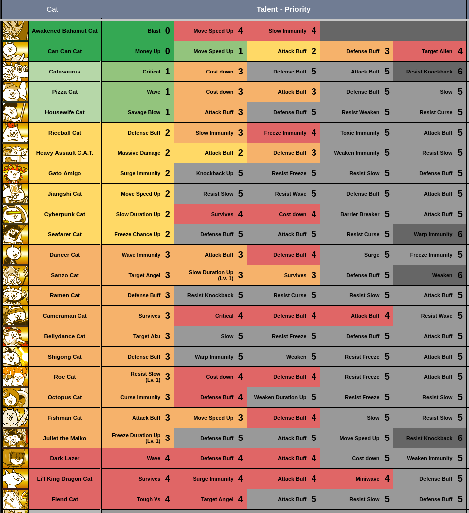

# Talent Priority Chart

# Talent Priority Explanations

## General Tips
- NP is precious and difficult to obtain! Don’t spend NP on random Talents on random units you’ll never use.
- In general, the priority levels exist for a reason. Get most or all Talents in a priority level before moving onto the next one.
- Rare and Super Rare Talents are not only cheaper, but are usually much more effective compared to Uber Talents. Focus on them first.
- In general, stat buff talents are not worth obtaining. Try and get them to level 50 first before even considering getting them. For some units like Can Can, however, the unit is so good that it’s okay to cough up the NP for 20% more damage/health. 
- Do not unlock “Do Not Unlock” talents. In almost all scenarios, they make your unit worse. Remember that Talents can’t be removed! 
## Disclaimers
Everything here assumes that you do not own certain Ubers that may greatly affect a Talent’s placement. Even Talents such as Pizza Cat’s Wave can be put aside for a bit if you own Kasa Jizo, for example. For the most part, the high priority Talents, especially the Top Priority Talents, remain true regardless of your Ubers, but after the High Priority Talents you may want to send a list of your Ubers if you don’t know what to Talent next. While we have tried to include notes in these descriptions regarding if you can move down Talents based on your personal unit collection, this can’t account for everything, so always ask if you’re not sure. 

If you did not get a certain Talent for a unit that has a certain priority, don’t get any other of their Talents either. 

Talents are not sorted between priorities, with the exception of Top Priority since you cannot obtain Bahamut’s Talents fresh out of ItF3. 

If a unit is listed as having (Talent 1) (Cost of Talent 1), (Talent 2) (Cost of Talent 2), this means that both of these Talents are simply on the same level of priority. If a unit is listed as having (Talent 1) (Cost of Talent 1) + (Talent 2) (Cost of Talent 2), you need to purchase all of that unit’s Talents in order to make them viable. Only buying 1/2 or 2/3 of those Talents won’t be enough to make that unit good enough to use.
## Top Priority
*Easily the best Talents in the game. Whenever you unlock them, get them.* 

**Can Can Cat** - Extra Bounties (75 NP): Extra Bounties is an insane Talent which makes Can Can a truly versatile unit, being able to gather huge amounts of cash early from supporting peons. With this Talent, Can Can becomes one of the strongest units in the entire game and a key component in your lineup throughout the mid to end game, due to how broken Extra Bounties is as an ability. Just killing a Doge Dark, for example, funds you enough money to deploy an Uber or Bahamut, allowing you to rapidly level up your Worker Cat.

**Awakened Bahamut Cat** - Explosion (235 NP): Turns Awakened Bahamut from good to broken. This Talent gives Bahamut double damage and pierce, making him one of the strongest units in the game outright. Just a single Bahamut hit against base hit stages allows him to cripple the boss that he attacks against, any peons alongside it, and any supporting enemies that may be present within the stage itself. Bahamut is almost always going to get value when deployed, due to how much damage 100k is to a surrounding area, even if he dies in one hit. Bahamut's Explosion also takes the art of Bahamut Chaining and elevates it to new heights; enemies that wouldn't have been damage knockbacked by one Bahamut hit will now, opening up the avenues of Bahamut chaining to enemies like Puffsley's Comet or Yulala. As a result, a Talented Bahamut is able to completely trivialize SoL, 1* UL, Starred UL, as well as numerous Advent stages and Tower floors. Given that ZL (and Starred ZL) is balanced around Bahamut’s Explosion, your main focus for the midgame should be trying to beat Bahamut Cat’s Trial to try and get access to Bahamut’s Talents. The 235 NP this Talent costs is the best NP you will ever spend in the entire game. 
## High Priority
*Extremely good Talents which grant your units powerful abilities or drastically improve their performance. Obtain these while you finish up Cats of the Cosmos and Stories of Legend.* 

**Catasaurus** - Critical (25 NP): For just 25 NP, you increase Catasaurus’s Critical chance by 5%, to 12%. The insane value you get for your NP should not be underestimated; being able to land more Crits, especially on a unit such as Catasaurus who attacks fast and is spammable, drastically improves the chance you’ll beat a certain Metal stage. 

**Can Can Cat** - Move Speed Up (125 NP): Makes Can Can a lot faster, allowing it to reach the frontline much faster. This, alongside Extra Bounties, makes Can Can a really good unit. While Move Speed Up is technically less important than Extra Bounties, the Speed increase is such a massive improvement on Can Can that this should be obtained as soon as possible.

**Pizza Cat** - Wave Attack (165 NP): While its proc rate is a bit low, if it lands Pizza gains double damage and pierce, which is extremely strong when fighting hordes of Dark enemies. Dark is already a very aggressive Trait, so giving Pizza this Talent will considerably assist you for tough Dark stages like DNA & DHA. Also helps his generalist damage considerably. This Talent is very strong for SoL given its tendency to spam enemies, as well as for XP grinding for stages like XP Colosseum or Merciless XP.
- You can delay this Talent if you own anti-Dark units like Kanna or Keiji. In particular, Kasa Jizo being essentially a second Pizza means that having him in your account will allow you to delay this Talent for a while.

**Housewife Cat** - Savage Blow (165 NP): Turns Housewife from a random Long Distance unit into a very competent LD attacker, making her a strong generalist option. Housewife’s anti-Zombie niche is also greatly improved, as a Savage Blow can cripple Zombies greatly. As a result, alongside Shigong, Housewife is almost always enough for ItF Outbreaks or Zombie SoL stages. Housewife's unique role in having LD, good damage, Zombie Killer, and Savage Blows additionally is fairly difficult to replicate with Ubers, and as such getting Savage Blow is recommended even if you have good anti-Zombie Ubers.
## Medium Priority
*These Talents are really good, but a bit pricey. Try to focus on these talents as you enter Uncanny Legends and maybe start 4 Crown SoL.* 

**Riceball Cat** - Defense Buff (125 NP): Riceball with this Talent gives him even more health than Manic Eraser, becoming one of the best meatshield options for 4* UL, alongside Rock and Talented Jiangshi Cat. Riceball for normal UL and Advent stages is also powerful in its own right. 

**Heavy Assault C.A.T.** - Attack Buff (125 NP) + Massive Damage (75 NP): Turns C.A.T. from a garbage unit into a useful anti-Dark rusher for stages such as Rank-Up Test 3 (Rank 12) and King of the Beasts: Final Bout. Other stages C.A.T. performs well in, compared to Pizza, are stages with Kurocroc, Dark Dober, or for dealing with Darks in 4 Crown. 
- You may want to delay this Talent if you already find that Assassin BearCat and Talented Bahamut are enough to deal with Darks in 4* SoL and in general. Owning Yukimura and/or Ultra Kasa Jizo also affects C.A.T.’s usage in regular stages.

**Gato Amigo** - Surge Immunity (75 NP): Gato’s Surge Immunity Talent gives him an actual niche for Surge stages like late Aku Realms or late UL, but more importantly is vital to own for all of Kappy Kawano’s stages, where you'll need an anti-Surge meatshield to prevent Kappy Kawano from pushing.
- You can delay this Talent if you own Cat Cactus, have powerful anti-Surge generalists like Kasli the Bane, or if you do not struggle on Kappy Kawano due to units like Izanami of Eventide or Issun Boshi.

**Jiangshi Cat** - Speed Up (75 NP):  Turns Jiangshi from a slow meatshield into a unit with a Speed similar to that of Manic Eraser’s. Jiangshi's Survive is very good as you start to do harder stages, where having meatshields that always live a hit is very beneficial to own, such as R. Ost stages or for any stage with strong frontline pushing power. Very helpful for 4* UL or general purposes. Can be moved higher if you have a boosted Li’l King Dragon. 

**Can Can Cat** - Attack Buff (125 NP): Can Can is so good that boosting its Attack by 20% helps a lot, especially for dealing with higher magged peons or for more difficult stages in UL. 

**Cyberpunk Cat** - Slow (125 NP): Doubles his Slow uptime, and is very helpful for more endurance based stages like many of the Manic stages, or even SoL stages if you’re struggling like Heaven’s Oasis or Procrastinator Parade, although there’s little real application before you clear An Ancient Curse. Once you do, Cyberpunk becomes very viable for Advents, such as With Sympathy where an endurance-based approach allows you to use Bahamut to solo the St. Dober, all of Xenobeast Bunnaglios's stages, or tough UL/ZL stages. 
- You can delay this Talent if you own CC units with a wide target variety like Assassilan Pasalan, Chronos, or Mitama.

**Seafarer Cat** - Freeze (125 NP):  Increases his chance of Freezing Aliens by 20%, which makes Seafarer a much more consistent unit to use. Very helpful for CotC in particular, but is useful throughout the whole game.
- You can delay this Talent if you have extremely powerful anti-Alien Ubers like Celestial Child Luna. 
## Low Tier
*Low Tier Talents are more useful for content towards the end of the game. Some of these Talents are very important to have, however, so don’t skip out on them just because they’re in Tier 3.*

**Riceball Cat** - Slow Immunity (75 NP): Slow Immunity on Riceball is a decent QOL Talent meant to allow Riceball to reach the frontlines, unhampered by enemies like Croakley, Sunfish Jones, or Condemned Peng. Because Riceball is already Knockback Immune, this also allows Riceball to work against M. Ost.
- You can skip this Talent if you are already fine with how Riceball operates and do not care much about Slow, or if you don’t use Riceball much in the first place.

**Heavy Assault C.A.T.** - Defense Buff (125 NP): C.A.T. benefits a lot from having its previously poor health be increased to allow it to rebound against Dark enemy hits. Alongside its built-in Weaken, C.A.T can tank a surprising amount of damage before going down. 

**Dancer Cat** - Attack Buff (125 NP) + Wave Immunity (75 NP): Turns Dancer from a garbage unit into a very solid midranger with heavy damage and Wave Immunity for 4 Crown. As a unit, Dancer is not only viable for 4 Crown or Wave purposes, but is also good enough to be used generally. 

**Catasaurus** - Cost Down (75 NP): Catasaurus is a common critter unit you’ll often use, so Cost Down can be helpful when you need to spam him. While you only save 150c per Catasaurus, this can quickly stack up due to Catasaurus’s low cooldown. It’s also pretty cheap for a unit you’ll be using often.
- You can skip this Talent if you’re not concerned about Metal stages, or if you already have strong Critters like Edgemaster Staal or Paladin Cat.

**Sanzo Cat** - Target Angel (50 NP), Slow (Level 1 Only, 5 NP), Survive (95 NP): While Sanzo’s Target Angel isn’t as high priority of a Talent as it was a few years ago, it is still very helpful to deal with melee Angel enemies like St. Dober, one of the hardest pushing Angels in the game or Boraphim. In particular, With Sympathy can be very difficult without a proper method to deal with St. Dober, and given that clearing the stage gives you the very helpful Bubble Cat, it is important to have Sanzo if you don’t have powerful Uber options to deal with the stage. Also very helpful for Heavenly Tower Floor 42. Slow adds 0.4 more seconds of Slow to Sanzo, which is a pretty good improvement for 5 NP. Survive increases Sanzo’s survivability pretty drastically, allowing him to get more attacks after he dies to things like St. Dober’s Surge. 
- You can delay Target Angel (and, by extension, the other Talents) if you already have powerful anti-Angel CC options like God-Emperor Daliasan, Himeyuri, or Mitama, or if you have units that can brute force St. Dober such as Ultra Kasa Jizo or Thunder Jack.

**Ramen Cat** - Defense Buff (75 NP): Ramen is a common unit for mid to lategame, so ensuring he tanks more hits from strong Angel enemies is a pretty good use of your NP.

**Cameraman Cat** - Survive (75 NP):  Survive allows Cameraman to always survive hits, which is a great thing to have. Do note that Cameraman falls off during UL compared to other generalist attackers like Slime or Housewife, so this Talent is better for 4 Crown purposes. Notably, this Talent is incredibly good if doing the classic Camera stack strategy for Kappy Jr. 
- Don't get this Talent if you already don't use Cameraman, even in 4* SoL. 

**Bellydancer Cat** - Target Aku (50 NP): Bellydancer’s Dodging is more useful against Akus, as they tend to have more stronger threats than Red for midgame. Bellydancer can be used for stages like The Aku Realms or Fury of Hell, although you can do these portions of the game without Bellydancer’s Talents fine enough. The main reason to buy Bellydancer is to help you in Feathergeddon III, as the stage features a huge amount of Akus alongside Poultrio which an untalented Bellydancer will die immediately to. Not having Bellydancer for Feathergeddon III also makes the stage much tougher due to the extremely limited amount of meatshields which work against this stage. 
- You can prioritize this Talent if you struggle against Fury of Hell.

**Shigong Cat** - Defense Buff (75 NP): Shigong, like Ramen, is a meatshield with Resistant for a strong pushing Trait, so buying Shigong’s Defense Talent is useful to have for more difficult Zombie stages, like Adventurer’s Journal 3* or Filibuster’s Zombie Outbreak.
- You can delay this Talent if you already have extremely good anti-Zombie options like CAT-10 Gigapult or Celestial Child Luna. 

**Can Can Cat** - Defense Buff (125 NP): Defense Buff is nice for Can Can since you’ll be using it so frequently, but it’s not super vital to own since Can Can already has a good amount of health already.

**Roe Cat** - Resist Slow (Level 1 Only, 10 NP): Literally the only reason to get this Talent is to help Roe more consistently reach the Professor A on I’ll Be Bug. This Talent is useless otherwise.
- Don’t get this if you’ve already beaten I’ll Be Bug and its Wrath stage. 

**Cyberpunk Cat** - Survive (165 NP): A bit pricy, but gives Cyberpunk a much needed opportunity to reposition if enemies push too far or if he gets hit by Waves/Surges/Explosions. 

**Octopus Cat** - Curse Immunity (75 NP): Throughout UL and ZL, Floating with Relics is a strangely common enemy combination, such as in stages like The Prince’s Woods, Smokestack to Heaven, Normal Activity, or 1+2 = Tor. Octopus is a good anti-Floating tanker that you’ll use quite often, so getting Curse Immunity helps secure Octopus’s role in walling Floating enemies for a while without having to worry about a Loris or Othom Cursing him.
- You can skip this Talent if you don’t find Floating + Relics to be a difficult combination, if you own Esoteric Uril, or if you have powerful anti-Floating Ubers like God-Emperor Daliasan, Supernova Cosmo, or Raclesa.

**Fishman Cat** - Move Speed Up (125 NP), Attack Buff (125 NP) - Moves faster now, allowing him to get to the frontlines faster as well as helping out for rush strategies. While this Talent does mess up his Othom and Bun Bun interactions to where they’re not perfectly consistent anymore, Othom is not relevant most of the time and Bun Bun at the end of the day is still best countered by Crowd Control. Attack Buff is an Attack Buff Talent, although it does take priority over a speedy Fishman. 

**Juliet the Maiko** - Freeze (Level 1 Only, 10 NP): Most of Juliet’s Freeze improvement from her Freeze Up Talent comes from its first level, which can be very handy for stages like Floor 26 or against St. Dober in general. It’s not a complete substitute for Sanzo Target Angel on With Sympathy, but it comes very close. 
- If you own strong anti-Angel Ubers and skipped Sanzo's Target Angel, the same reasoning applies here.

**Pizza Cat** - Cost Down (125 NP), Attack Buff (125 NP): Cost Down is a fine enough QOL Talent allowing you to send out Pizza earlier. Note that there is a little bit of controversy whether or not you should max this Talent out, as the 1200c+ Restriction used in CotC and on stages like Prisoner’s Progress may be used in the future, and having a level 6 or higher Cost Down on Pizza makes Pizza unusable on these stages. Regarding Attack Buff, more damage against Dark is always good, especially since Dark is a pretty relevant trait up until endgame. Pizza’s build is strong enough to work in a pinch on enemies such as Dark Dober, so it’s not that bad if you’re struggling against Darks. 
- You can skip both Talents if you already have very powerful anti-Dark nuker Ubers like Ultra Kasa Jizo or Adventurer Kanna. 

**Housewife Cat** - Attack Buff (125 NP): Housewife is a very solid ranged unit, and getting her Attack Talent improves her performance by quite a lot. 
- You can skip this Talent if you already don’t often use Housewife.
## Luxury Priority
*You should probably be pivoting into buying Uber Talents by this point in the game. These Talents aren’t exactly terrible/basically useless like the next tier, but they’re pretty substantial investments, or are very niche. Consider what you want to do with your NP before buying stuff here.*

**Riceball Cat** - Freeze Immunity (75 NP): Freeze Immunity is pretty nice to help you meatshield against enemies like I.M. Phace, Zir Zeal, or to help Riceball get to the frontline against Freezing enemies like Marquis Clionius or Henry. Freeze Immunity is lower than Slow Immunity mainly because most enemies with Freeze naturally have high damage, in most cases being able to just one-shot Riceball, such as I.M. Phace or Chickful A in Starred stages. 

**Dark Lazer** - Wave Attack (165 NP) + Defense Buff (125 NP) + Attack Buff (125 NP): While very expensive, maxing out all three of these Talents allows Dark Lazer to become a menace with high stats against Dark and Red enemies, in particular completely shutting down Dark Dober or Bersekory. Note that you do not need to purchase these Talents for Wrath of Carnage; Dark Lazer’s Talents are better suited for 3/4* UL, or in ZL for Le’Prude. 

**Dancer Cat** - Defense Buff (125 NP): While giving Dancer 80% more health is good, Dancer’s main appeal is his damage and not his bulk. 

**Li’l King Dragon Cat** - Surge Immunity (75 NP) + Survive (165 NP), Attack Buff (125 NP), Mini-Wave (165 NP): Allows Li’l King Dragon to become a very strong Surge Immunity backliner for stages such as Ashes Just Ahead, Omens, or Ghost King Finale, especially alongside a talented Jiangshi. However, this is a lot of NP to spend on a Surge Immune unit. Can be moved down if you already own strong Surge Immune options. Do not get these Talents if your LKD is not at least level 80. The common consensus for LKD’s Talent Priority is to get Surge Immunity and Survive together, then get Attack Buff, then save Mini-Wave for last.

**Awakened Bahamut Cat** - Move Speed Up (175 NP), Slow Immunity (100 NP): While minor, Bahamut being able to speed towards the frontline is always helpful for rush strategies. Notably, this creates an interaction on Birth of True Man where if Bahamut hits the base, Luza’s hits both miss, allowing Bahamut and your rushers to demolish Luza before Hazuku comes. This also creates a very minor interaction where Bahamut is just able to get in a hit before Lowkey or Papaou attacks it. Slow Immunity is mainly QOL, though if you don’t have any Ubers a Slow Immune Bahamut does completely destroy Prisoner’s Progress by being able to tank a Daboo hit and dishing out insane amounts of damage against Daboo. Other than that, Slow Immunity is mainly for if you mess up a timing and send Bahamut into an enemy like Croakley.

**Cameraman Cat** - Critical (50 NP), Defense Buff (75 NP), Attack Buff (75 NP): Critical should only be purchased for March to Death, as it is unreliable and finicky otherwise. With that said, it does make March to Death a lot easier, as Camera’s high damage will allow her to deal serious damage onto the Metal enemies present in that stage. Defense and Attack Buff simply improves Camera’s stats, though if you already don’t find yourself using Camera in 4* UL much you can skip both. 

**Can Can Cat** - Target Alien (75 NP): Target Alien is mainly for CotC purposes to Slow some hard pushing enemies like Nimoy Bore, Star Peng, or GreGory, especially since you’ll constantly be using Can Can, though it finds some odd usage here and there like on Puffer Planet.
- You can skip Target Alien if you do not care about role compression, or if you already have competent anti-Alien CC options like Celestial Child Luna.  

**Roe Cat** - Defense Buff (125 NP), Cost Down (125 NP): Defense Buff is pretty relevant on Roe who already has a great base health stat, but during the endgame Roe is mostly outclassed by Rapper in most scenarios to where there are little relevant stages left for it to shine. Cost Down is subject to the same issues as Pizza’s Cost Down Talent mentioned above.

**Cyberpunk Cat** - Cost Down (125 NP): Just makes Cyberpunk cheaper. It's nice for if you're doing stages where you're hardpressed for cash and you'll be sending out more than one Cyberpunk throughout the course of the battle, but saving 750c per Cyberpunk usually won't be making a ton of difference. 

**Octopus Cat** - Defense Buff (125 NP): The same thing about Roe’s Defense Buff Talent also applies here. In addition, Wave enemies are hyperbuffed during endgame and usually end up killing Octopus very quickly.

**Fishman Cat** - Defense Buff (125 NP): More health on Fishman is never a bad thing, though he doesn’t really gain that much health given his base HP.

**Fiend Cat** - Resistant (75 NP), Target Angel (75 NP): Gives Fiend much higher health against its target traits, and Knockback vs. Angel is a surprisingly useful benefit for Fiend to have. These Talents are very nice, but aren’t needed for most stages.
## No Priority
**Flying Ninja Cat** - Target Dark, Dodge, Move Speed Up, Defense Buff, Attack Buff: You do not need this for Poultrio. 

**Riceball Cat** - Toxic Immunity, Attack Buff: Toxic Immunity only has two real enemies to be applied on in Gobble and Zollow. Most of Gobble and Zollow’s stages are either stages that are really easy, gimmick stages, or stages where Riceball isn’t a good choice to begin with like Oil Spill Rainbow.

**Pastry Cat** - Barrier Breaker, Weaken, Resist Slow, Defense Buff, Attack Buff

**Skelecat** - Weaken, Resist Slow, Recover Speed Up, Defense Buff, Attack Buff

Heavy Assault C.A.T - Weaken Immunity, Resist Slow: C.A.T. doesn’t really care about Kurocroc’s Weaken since it’ll usually just kill it in two hits, and for Dark Dober you can just send more C.A.Ts to replace one that just got Weakened.

**Gato Amigo** - Knockback, Resist Freeze, Resist Slow, Defense Buff

**Ultimate Bondage Cat** - Freeze, Dodge Attack, Slow Immunity, Defense Buff, Attack Buff: You do not need this for Poultrio. 

**Dark Lazer** - Cost Down, Weaken Immunity (225 NP): See Pizza’s Cost Down Talent above for notes on Lazer's Cost Down. Weaken Immunity is mostly useless as Dark Lazer’s DPS is already high enough against Dark Dober, and because her matchup is already bad against Kurocroc.   

**Dancer Cat** - Surge Attack: Too expensive for what it does, and misses too often. 

**Beefcake Cat** - Attack Buff, Surge Immunity, Resist Slow, Defense Buff, Attack Buff

**Loincloth Cat** - Barrier Breaker, Warp Immunity, Weaken Alien, Defense Buff, Attack Buff  

**Lollycat** - Slow Metal, Weaken Immunity, Resist Freeze, Defense Buff, Attack Buff: Slow Metal is completely unneeded with units such as Hoopmaster, Puppetmaster & Charley, and Catasaurus. 

**Hyper Mr.** - Knockback vs. Zombie, Freeze Immunity, Warp Immunity, Defense Buff, Attack Buff

**Li’l Mohawk Cat** - Critical Hit, Wave Immunity, Slow Immunity, Defense Buff, Attack Buff: There are two Wave Immune meatshields who don’t need NP in Glittering Macho and Carpenter Cat. While Glittering Macho needs a Gold Fruit and is rare, Carpenter comes from the easiest Brutal in the game and is also a good meatshield for Floating and Red. Obtaining both makes Li'l Mohawk's Wave Immunity Talent unneeded.

**Li’l Eraser Cat** - Resist Toxic, Dodge vs. Zombie, Defense Buff, Attack Buff: Li’l Eraser isn’t needed for Oldstritch since Shigong usually walls it fine enough, so there’s no need to boost Li’l Eraser or get Talents for it that improve its survivability. For 4* UL, you have Riceball, Rock, and Jiangshi already as well.  

**Li’l Dark Cat** - Target Aku, Freeze, Resist Surge, Defense Buff, Attack Buff

**Li’l Macho Legs Cat** - Shield Piercing, Knockback, Resist Curse, Defense Buff, Attack Buff: Entirely outclassed by Aku Researcher, and is not needed to beat Aku Cyclone due to the existence of brute force strategies.

**Li’l Lion Cat** - Shield Piercing, Cost Down, Surge Immunity, Defense Buff, Attack Buff  

**Li’l Flying Cat** - Target Relic, Curse Immunity, Curse, Defense Buff, Attack Buff

**Li’l Island Cat** - Target Aku, Wave Attack, Resist Curse, Defense Buff, Attack Buff

**Li’l King Dragon Cat** - Defense Buff

**Li’l Jamiera Cat** - Shield Piercing, Weaken Immunity, Resist Surge, Defense Buff, Attack Buff

**Holy Valkyrie Cat** - Freeze, Strengthen, Cost Down, Defense Buff, Attack Buff: Becomes good with her Talents, but is too expensive for any player to reasonably obtain. 

**Cat God the Golden** - Weaken, Dodge, Curse Immunity, Defense Buff, Attack Buff

**Metafilibuster** - Massive Damage, Freeze, Recover Speed Up, Defense Buff, Attack Buff: Remains impractical to use and costs too much NP. 

**Jiangshi Cat** - Resist Slow, Resist Wave, Defense Buff, Attack Buff: Jiangshi’s endurance is already pretty bad, and in most stages Jiangshi will be taking enough damage to trigger its Survive immediately, so increasing Jiangshi’s health doesn’t do much.

**Chill Cat** - Resist Weaken, Defense Buff, Attack Buff, Cost Down: Chill Cost Down could be theoretically considered for Puffer Planet, but there are better options available, and even with Cost Down many of Chill’s issues still remain.

**Cyborg Cat** - Survive, Toxic Immunity, Resist Freeze, Defense Buff, Attack Buff: Cyborg’s foreswing is fast enough to kill Zollows even untalented, so Toxic Immune doesn’t do much. Cyborg also naturally gets outclassed as the game progresses, so you shouldn’t buy Cyborg’s stat talents.

**Catasaurus** - Defense Buff, Attack Buff

**Maximum the Fighter** - Slow Immunity, Resist Curse, Weaken Immunity, Toxic Resist, Defense Buff

**Dread Pirate Catley** - Wave Immunity, Survive, Resist Slow, Defense Buff, Attack Buff: Do not spend 50 NP on this unit to beat Floor 30. There are better options available. 

**Goemon Cat** - Strengthen, Zombie Killer, Defense Buff, Attack Buff, Move Speed Up

**Sanzo Cat** - Defense Buff

**Doctor Cat** - Resist Knockback, Resist Curse, Target Relic, Defense Buff, Attack Buff: Doctor Target Relic used to be recommended for Starred UL’s Oldhorns, but thanks to Royal Guard that remaining niche is now gone, leaving Doctor with no usage for his Talents. 

**Necro-Dancer Cat** - Wave, Toxic Immunity, Resist Freeze, Defense Buff, Attack Buff

**Enchantress Cat** - Slow, Survive, Target Zombie, Defense Buff, Attack Buff

**Cataur** - Zombie Killer, Target Zombie, Defense Buff, Attack Buff, Recover Speed Up: He is not good for Oldstrich or Cadaver Bear. 

**Elemental Duelist Cat** - Resist Weaken, Target Angel, Defense Buff, Attack Buff, Recover Speed Up

**Rodeo Cat** - Target Relic, Resist Curse, Defense Buff, Attack Buff, Recover Speed Up: The only reason to ever get Rodeo is to beat Primeval Cyclone, and even then Professor Cat Jobs (or anti-Relic Uber spam) does the same thing. Once you get Modern Cat, Rodeo becomes useless due to its lack of range.  

**Acrobat Cats** - Surge Attack, Wave Immunity, Resist Freeze, Defense Buff, Attack Buff

**Robocat** - Dodge, Resist Curse, Defense Buff, Attack Buff

**Ramen Cat** - Resist Slow, Resist Knockback, Resist Curse, Attack Buff: Ramen is good, but that doesn’t mean you should invest in any of Ramen's Resist talents, since they don't really do anything.

**Cameraman Cat** - Resist Wave

**Corruped Psychocat** - Weaken, Slow, Resist Freeze, Target Zombie, Defense Buff

**Thaumaturge Cat** - Resist Freeze, Resist Curse, Wave Immunity, Defense Buff: Wave is powercrept to the point where Thauma Wave Immunity has little application. 

**Weedwhacker Cat** - Target Aku, Resist Surge, Resist Slow, Defense Buff, Attack Buff

**Ectoweight Ca**t - Target Alien, Resist Weaken, Savage Blow, Defense Buff, Attack Buff

**Catellite** - Curse Immunity, Resist Knockback, Defense Buff, Attack Buff: Crept by Jetpack by the time you consider stat Talents, and Catellite even with Curse Immunity Talents is still not good for Alien/Relic mixed stages. 

**Shigong Cat** - Warp Immunity, Weaken, Resist Freeze, Attack Buff: Shigong’s Weaken Talent is very poor in quality, so it’s mostly a waste of NP. Warp Immunity only counters a single enemy (Zapy) and only counters a single stage (Top Dog), which is already beatable without Shigong’s Warp Immune. Top Dog is also rushable.

**Bellydancer Cat** - Slow, Resist Freeze, Defense Buff, Attack Buff

**Roe Cat** - Resist Freeze, Attack Buff

**Cyberpunk Cat** - Barrier Breaker, Attack Buff

**Octopus Cat** - Weaken, Resist Freeze, Resist Slow  

**iCat** - Resist Slow, Resist Freeze, Move Speed Up, Defense Buff, Attack Buff: Move Speed Up may seem appealing for Hannya cheeses, but it already works without needing to Talent iCat. 

**Fishman Cat** - Slow, Resist Slow - Slow isn’t great on Fishman because he’s Single Target. It also costs a lot of NP and doesn't have the greatest uptime.

**Luxury Bath Cat** - Resist Weaken, Resist Wave, Defense Buff, Attack Buff

**Ultra Delinquent Cat** - Strengthen, Savage Blow, Resist Weaken, Defense Buff, Attack Buff

**Tathagata Cat** - Weaken, Slow, Defense Buff, Attack Buff, Move Speed Up

**Juliet the Maiko** - Resist Knockback, Attack Buff, Defense Buff, Move Speed Up

**Pizza Cat** - Slow: Doesn’t actually do anything, and it’s too inconsistent and expensive to rely on even as a secondary CC. 

**Slapstick Cats** - Weaken, Resist Slow, Defense Buff, Attack Buff: Slapsticks is outclassed as you progress through Crowned UL and ZL, making its stat Talents unneeded.   

**Catophone** - Barrier Breaker, Target Alien, Defense Buff, Attack Buff, Cost Down

**Seafarer Cat** - Resist Curse, Defense Buff, Attack Buff

**Housewife Cat** - Resist Weaken, Resist Curse, Defense Buff

**The Kitty of Liberty** - Resist Curse, Defense Buff, Attack Buff

**Fiend Cat** - Resist Slow, Defense Buff, Attack Buff

**Artist Orthos CC** - Knockback, Slow Immunity, Mini-Surge, Defense Buff, Attack Buff

**Citizen Mola** - Weaken vs. All, Freeze vs. All, Slow vs. All, Knockback vs. All, Curse vs. All
## Do Not Unlock
*These Talents are straight up bad and will make your units worse. Do not get these.*

**Li’l Eraser Cat** - Soulstrike - Soulstrike will trap Li’l Eraser on corpses and prevent it from moving up to defend against frontline threats. 

**Chill Cat** - Knockback: Knockbacking Aliens is really bad, for two reasons. The first is that given Chill is a unit that works best when spammed, having one Chill Knockback its target (like with Star Peng) will cause the rest to miss. In addition, Alien enemies are usually supported by strong backliners, so when the frontline is Knockbacked, your Chill stack will walk up and then be nuked by a powerful backliner hit. 

**Sanzo Cat** - Weaken: While Weaken on Sanzo seems like a good additional CC alongside Slow, Sanzo’s Weaken only weakens enemies to 75%, which is much less potent compared to other Weaken units, who weaken to 50% or lower. Sanzo’s Weaken carries the risk of overwriting stronger Weakens from Ubers or other units with its own less potent Weaken.   

**Robocat** - Knockback Immunity - Reduces the amount of repositions it can get. 

**Catellite** - Barrier Breaker: Prevents stacking of units on UltraBaaBaa, such as on Requiem for Angels. 

**Luxury Bath Cat** - Knockback: See Chill Cat’s section. Knockback is worse on Bath and The Kitty of Liberty given that they are single target units. 

**Slapstick Cats** - Knockback Immunity: Messes its interaction up with M. Ost, causing it to take damage knockbacks instead of getting free repositions. 

**Seafarer Cat** - Warp Immunity: Seafarer wants to be Warped because it grants him more chances to reposition.

**The Kitty of Liberty** - Knockback vs. Alien, Warp Blocker: KoL only has one knockback, so being Warped is actually good for it. See Bath Cat’s section for an explanation of Knockback.
