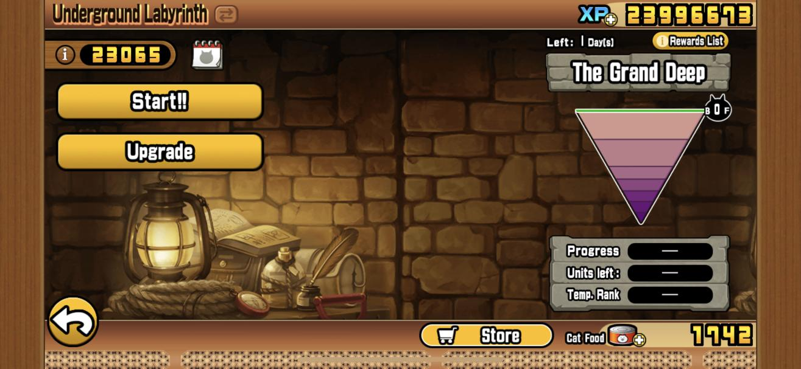
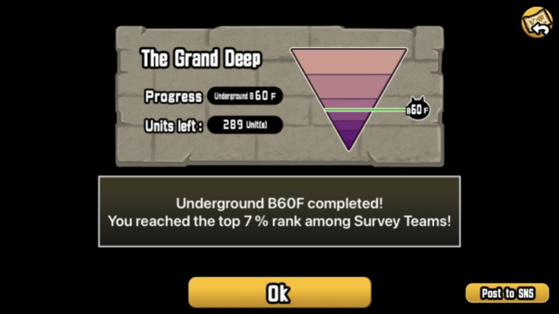
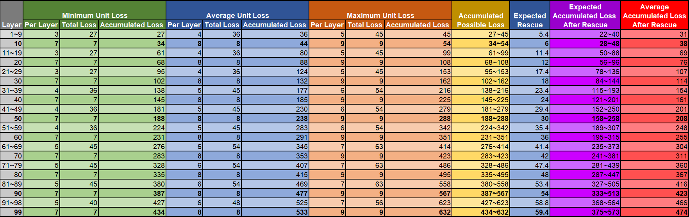

---
title: Underground Labyrinth
---

## What is it?

The Underground Labyrinth is a limited event similar to Legend Quest or the Heavenly Tower, which shows up in the main menu. The main goal is to get as far as you can using varying lineups.

### When can I play it, and why should I play it?

Labyrinth has no consistent schedule, but when available you must have at least cleared ItF 3. The main appeal of the Underground Labyrinth is the high amount of Dark Catseyes you can obtain from it.

### How do rewards work?

Like the Catclaw Dojo, Labyrinth has a scoring-based system, which compares you and other players' progress on the Labyrinth. Doing better will get you a lot more rewards, including Dark Catseyes. In addition, doing Labyrinth stages will also grant you additional rewards just by clearing them. Stages 10, 50, 90, 95, 99, and 100 will drop Dark Catseyes, while other stages that are multiples of 10 will drop Legend Catseyes. Additionally, all stages have a chance to drop either XP or 1/2 Catseyes of varying rarities, at a 50% chance. 

### How do stages work?

Every stage here has the No Continues restriction, but the more important part about Labyrinth is lineup building. After you clear each stage, a set number of your units will be trapped, preventing you from using them for the rest of the run. Each stage lineup must have 10 units to proceed. Sometimes, you will also get the option to "rescue" one of your trapped units, which allows you to keep using that unit until it gets trapped again. Furthermore, any units you add to your lineup will become "locked", meaning you cannot swap them out. 

### How does trapping work?

Every time you beat a stage, a certain amount of units in your lineup will be trapped. This amount is dependant on the specific floor you are. As a rule of thumb, the closer you are to Stage 100, the more units that will be trapped. You have a 60% chance to get a chance to rescue one of your trapped units. Losing or backing out of a stage will trap two units and will not give you a chance to rescue. 

* Stages 1-9, 11-19, and 21-29 will trap 3-5 units.
* Stages 31-39, 41-49, and 51-59 will trap 4-6 units.
* Stages 61-69, 71-79, 81-89, and 91-98 will trap 5-7 units.
* Every 10th stage and Stage 99 will trap 7-9 units.

### How do I best do Labyrinth?

Your first priority is to always win, so you will want to avoid wasting units to try and get as far as possible. To achieve this, always bring 1-2 units that are able to win the stage on their own regardless of what the rest of the lineup looks like. This is made easier by the fact that most Labyrinth stages are pretty easy. 

Your second priority is to save your valuable units for as long as possible. Competent attackers and meatshields are the strongest units you will have, and as such you should save them for later segments of Labyrinth. For this, the previously stated 1-2 good unit rule of thumb will play well, since it reduces the odds of them being trapped units, while also giving you the room to rescue them if they do get trapped.

Your third priority, which becomes more prevalent the more units you have and the further you aim to go, is to get rid of all the bad units and units which require heavy support early on. Even by Labyrinth standards, many units are extremely weak. Be these collabs, seasonal, or monthly units, these units are what you want to be bulking your lineup with. This also applies to units that would require heavy support to function, like Filibuster, since Labyrinth's format means that you might not always have the units to make them work. As a side note, Ubers are a rarity that you'll end up with a huge amount of compared to other rarities, so you should try to thin out your Uber collection sooner rather than later. 

## Credits

**lanxcapo** (original guide creation)
**??????** (Labyrinth loss chart creation)
**hungerybalgor** (Labyrinth guide image creation)
**goomister29** (updates and web conversion)

